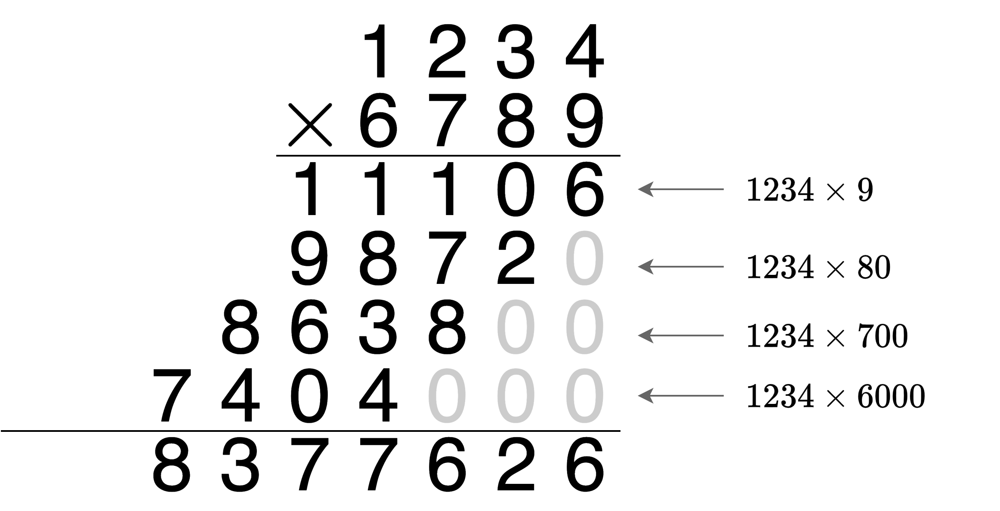
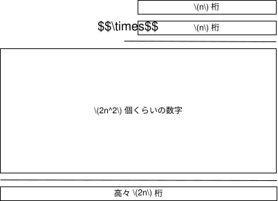
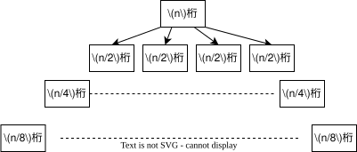
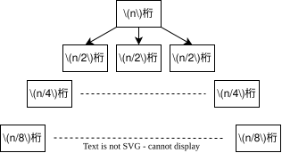

# 再帰関数

---
layout: top-title
color: amber-light
---
::title::
# 再帰関数
::content::

<div class="topic-box">

プログラミングにおいて, 関数の中で関数を呼び出すという操作を**再帰**と呼び, 再帰を行う関数を**再帰関数**という.

</div>

- 元来「再帰」という用語は様々な分野(言語学, 論理学, 数学など)で登場する用語である
  - 端的に言えば, ある概念$X$を定義する際に, その記述が$X$自身を含むことを指す
- 例: フィボナッチ数列$(a_n)_{n\in\Nat}$の定義は
  $$
    a_n =
    \begin{cases}
      0 & (n=0) \\
      1 & (n=1) \\
      a_{n-1} + a_{n-2} & (n\geq 2)
    \end{cases}
  $$
  これは$a_n$の定義の中に$a_{n-1}$や$a_{n-2}$が含まれているので, 再帰である
- より一般に漸化式は全て再帰であるといえる

---
layout: top-title
color: amber-light
---
::title::
# 再帰関数の例
::content::
- 再帰関数の例として, フィボナッチ数列を求める関数を考える

```python
def fib(n):
    if n == 0:
        return 0
    if n == 1:
        return 1
    else:
        return fib(n - 1) + fib(n - 2)

```

<v-clicks>

- この関数は, $n$が0または1のときは直接値を返し, それ以外のときは再帰的に`fib(n-1)`と`fib(n-2)`を計算してその和を返す (7行目)
  - このように, 自分自身の呼び出しのことを**再帰呼び出し**という
- どんな$n>1$であっても再帰呼び出しを繰り返すといずれ4行目の条件が満たされるので, 再帰呼び出しは必ず終了する
  - しかし, 例えば`fib(-1)`を実行しようとすると, 再帰呼び出しは`fib(-2)`, `fib(-3)`と続き, 終了しない
  - 再帰関数を実装する際は必ず終了するように気をつけなければならない

</v-clicks>


---
layout: top-title
color: amber-light
---
::title::
# 再帰関数の例
::content::
- 再帰関数の別の例として, 階乗を求める関数を考える

```python
def factorial(n):
    if n == 0:
        return 1
    else:
        return n * factorial(n - 1)
```

<v-clicks>

- この関数は, $n$が0のときは1を返し, それ以外のときは再帰的に`factorial(n-1)`を計算してその結果に$n$を掛けた値を返す (7行目)
- この関数も再帰呼び出しを繰り返すことで, いずれ2行目の条件`n==0`が満たされるので, 再帰呼び出しは必ず終了する

</v-clicks>

---
layout: top-title
color: amber-light
---
::title::
# 再帰関数の応用: べき乗法
::content::

<div class="question">

与えられた$a,b\in\Nat$に対し, $a^b$を計算せよ (計算量は演算回数で測る).

</div>

<v-clicks>

普通に計算すると, $a,a^2,a^3,\dots,a^b$ と順に計算していくことになるので, $b$回の掛け算が必要となる
```python
def power(a, b):
    result = 1
    for _ in range(b):
        result *= a
    return result
```


<div class="theorem">

計算量$O(\log b)$で$a^b$を計算できる.

</div>

- 上のアルゴリズムの計算量$O(b)$よりはるかに高速
- これを可能にするアルゴリズムがべき乗法

</v-clicks>

---
layout: top-title
color: amber-light
---
::title::
# べき乗法のアルゴリズム
::content::

再帰を使って$a^b$を計算することを考える. 関数名を`fast_power(a, b)`とする.
- $b\in\{0,1\}$のときは, $a^b$を出力すればよい (出力は$1$または$a$なので, $O(1)$時間)

```python
if b==0:
  return 1
if b==1:
  return a
```

- $b\ge 2$が偶数のとき, $a^b = a^{(b/2)}\cdot a^{(b/2)}$である. $a^{(b/2)}$を再帰的に計算すればよい.
```python
if b >= 2 and b % 2 == 0:
  half = fast_power(a, b // 2) # b//2はbを2で割った商 (少数部分は切り捨て)
  return half * half
```

- それ以外 ($b\ge 2$が奇数) のとき, $a^b = a^{\frac{b-1}{2}} \cdot a^{\frac{b-1}{2}} \cdot a$である. $a^{(b-1)}$を再帰的に計算すればよい.
```python
else:
  half = fast_power(a, (b - 1)//2)
  return half * half * a
```
---
layout: top-title
color: amber-light
---

::title::
# べき乗法の実装
::content::

```python
def fast_power(a, b):
    if b == 0:
        return 1
    if b == 1:
        return a
    
    if b >= 2 and b % 2 == 0:
        half = fast_power(a, b // 2)
        return half * half
    else:
        half = fast_power(a, (b - 1) // 2)
        return half * half * a    
```

<v-click>

- この関数の計算量(演算回数)はどうなるだろうか?
  - $b\ge 2$が偶数でも奇数であっても, 次の呼び出しにおいて$b$は高々半分になる
  - 従って, 呼び出しの回数は高々$\log_2 b$回で抑えられる
  - 各呼び出しでの演算回数は高々4回である
- よって, この関数の計算量は $O(\log b)$ である
  
</v-click>

---
layout: top-title
color: amber-light
---
::title::
# べき乗法の応用例: 行列のべき乗とフィボナッチ数列
::content::

- べき乗法では$a^b$を計算したが, ここで$a$は数である必要はない. 例えば, 行列$A$に対して, $O(\log b)$回の行列乗算で$A^b$を計算することもできる.

<v-clicks>

- この性質を使ってフィボナッチ数列を高速に計算することができる.


<div class="definition">

フィボナッチ数列$(a_n)_{n\in\mathbb{Z}_{\ge 0}}$は以下の漸化式で定まる数列$(a_n)_{n\ge 0}$である:
$$
\begin{align*}
a_n &= \begin{cases}
0 & (n=0) \\
1 & (n=1) \\
a_{n-1} + a_{n-2} & (n\geq 2)
\end{cases}
\end{align*}
$$

</div>

愚直に$a_0,a_1,\dots,$の順に計算すると, $a_n$の計算に$O(n)$の時間がかかる.

</v-clicks>

---
layout: top-title
color: amber-light
---
::title::
# フィボナッチ数列の行列表示
::content::
- フィボナッチ数列は行列を使って次のように表現できる (ただし$n\ge 0$)
$$
\begin{align*}
\begin{pmatrix}
a_{n+1} \\
a_{n}
\end{pmatrix}
=
\begin{pmatrix}
1 & 1 \\
1 & 0
\end{pmatrix}^n
\begin{pmatrix}
1 \\
0
\end{pmatrix}
\end{align*}
$$

<v-clicks>

- $a_n$は, 行列$A=\begin{pmatrix}1 & 1 \\ 1 & 0\end{pmatrix}$に対し, $A^n$を計算することによって求められる.
- べき乗法を使って$A^n$を計算すると, フィボナッチ数列の$n$番目の項を$O(\log n)$で計算できる.

</v-clicks>

---
layout: top-title
color: amber-light
---
::title::
# 再帰関数の応用: 掛け算
::content::

<div class="question">

与えられた2つの$n$桁の自然数$a,b\in\Nat$に対し, $a\times b$ を計算せよ. 計算量は一桁同士の掛け算と足し算の回数で測る.

</div>

<v-click>

小学校で習うアルゴリズム: **筆算**

<div class="image-container" style="width: 50%; margin: auto;">
  
</div>

</v-click>

---
layout: top-title
color: amber-light
---
::title::
# 再帰関数の応用: 掛け算
::content::

一般に, $n$桁同士の積を筆算すると $O(n^2)$ 時間かかる.

<div class="image-container" style="width: 50%; margin: auto;">
  
</div>

<div class="remark">

$n$桁同士の足し算は筆算により$O(n)$時間で計算できる.

</div>

---
layout: top-title
color: amber-light
---
::title::
# 再帰に基づく掛け算
::content::

- 数字$a$の各桁の数字を一の位から順に$a_0,a_1,\dots,a_{n-1} \in \{0,1,\dots,9\}$とする. このとき
  $$
  a = a_0 + 10a_1 + 10^2 a_2 + \dots + 10^{n-1} a_{n-1} = \sum_{i=0}^{n-1} a_i 10^i.
  $$

  
<v-clicks>  

- これを $a=[a_0,a_1,\dots,a_{n-1}]$ と表す.

  - 例えば, $1234=[1,2,3,4]$, $9876=[9,8,7,6]$である.

- 簡単のため, $n$は2ベキ, すなわち$n=2^k$の形であるとする
  - そうでない場合は, 最後の桁に$0$を挿入して桁数を2べきにする. これによって桁数は高々2倍となる.
  - 例えば $a=12345$ ならば, $a=[1,2,3,4,5,0,0,0]$ とする

</v-clicks>

---
layout: top-title
color: amber-light
---
::title::

# 再帰に基づく掛け算

::content::


- $c=[c_0,\dots,c_{n-1}]$に対し
  - 左半分の桁からなる数字を$c_L=[c_0,\dots,c_{n/2-1}]$
  - 右半分の桁からなる数字を$c_R=[c_{n/2},\dots,c_{n-1}]$とする
  - 例えば$c=1234$ならば, $c_L=[1,2]$, $c_R=[3,4]$である.
  
<v-clicks>

- 特に, $c=c_L + c_R 10^{n/2}$と表せる.

- 求めたい積$a\times b$は
  $$ \begin{align*}
  a \times b &= (a_L + a_R 10^{n/2})(b_L + b_R 10^{n/2}) \\
  &= {\color{blue}a_L b_L} + {\color{green}(a_L b_R + a_R b_L)}\times  10^{n/2} + {\color{red}a_R b_R} \times 10^n
  \end{align*}
  $$

</v-clicks>

---
layout: top-title
color: amber-light
---
::title::
# 再帰に基づく掛け算
::content::

- 求めたい積$a\times b$は
  $$
  a \times b = (a_L + a_R 10^{n/2})(b_L + b_R 10^{n/2}) = {\color{blue}a_L b_L} + {\color{green}(a_L b_R + a_R b_L)}\times  10^{n/2} + {\color{red}a_R b_R} \times 10^n
  $$

  - $\times 10^{n/2}$ や $\times 10^n$ の計算は簡単 (後ろに$0$を追加するだけ)
  - 足し算は$O(n)$時間で計算できる
- したがって, $a\times b$を計算するためには四つの積 ${\color{blue}a_L b_L}$, ${\color{green}a_L b_R}$, ${\color{green}a_R b_L}$, ${\color{red}a_R b_R}$ を計算すればよい

<div class="question">

四つの積 ${\color{blue}a_Lb_L},{\color{green}a_Lb_R},{\color{green}a_Rb_L},{\color{red}a_Rb_R}$ を再帰的に計算すると?

</div>

一度の再帰呼び出しで桁数は半分になるが, 再帰呼び出しは4回行われる.

---
layout: top-title
color: amber-light
---
::title::
# 再帰に基づく掛け算
::content::

<div class="question">

四つの積 ${\color{blue}a_Lb_L},{\color{green}a_Lb_R},{\color{green}a_Rb_L},{\color{red}a_Rb_R}$ を再帰的に計算すると?

</div>

- 一度の再帰呼び出しで桁数は半分になるが, 再帰呼び出しは4回行われる.

<div class="image-container" style="width: 50%; margin: auto;">
  
</div>

- 各四角形(=呼び出し)内部では, 足し算が行われているので, $O(\text{桁数})$の時間がかかる.

<div class="topic-box">

全体の計算量 = 全ての呼び出し内部の計算量の総和

</div>

---
layout: top-title
color: amber-light
---
::title::
# 再帰に基づく掛け算
::content::

全体の計算量はいくつになるだろうか?

- $n$桁の呼び出し : $1$回
- $n/2$桁の呼び出し : $4$回
- $n/4$桁の呼び出し : $16$回
- $n/8$桁の呼び出し : $64$回
- $\dots$
- $1$桁の呼び出し : $4^{\log_2 n} = n^2$回

<div class="topic-box">

全体の計算量は $1+4+16+\dots+4^{\log_2 n} = O(n^2)$. つまり筆算と同じオーダー.

</div>

---
layout: top-title
color: amber-light
---
::title::
# カラツバ法
::content::

<div class="theorem">

$n$桁同士の掛け算を$O(n^{\log_2 3}) \approx O(n^{1.585})$時間で計算できる.

</div>

アイデア:
  $$
  a \times b = {\color{blue}a_L b_L} + {\color{green}(a_L b_R + a_R b_L)}\times  10^{n/2} + {\color{red}a_R b_R} \times 10^n
  $$

三つの値 ${\color{blue}a_Lb_L},{\color{green}a_Lb_R+a_Rb_L},{\color{red}a_Rb_R}$ を**3回**の再帰呼び出しで計算する

<div class="topic-box" v-click>

1. ${\color{blue}a_Lb_L}$と${\color{red}a_Rb_R}$を計算する (**2回**の再帰呼び出し)
2. $(a_L+a_R)(b_L+b_R)$を計算する (**1回**の再帰呼び出し)
3. ${\color{green}a_Lb_R+a_Rb_L} = (a_L+a_R)(b_L+b_R) - {\color{blue}a_Lb_L}-{\color{red}a_Rb_R}$ を計算する (再帰呼び出しは不要)

</div>

---
layout: top-title
color: amber-light
---
::title::
# カラツバ法
::content::

- $(a_L+a_R)(b_L+b_R)$の計算は高々$n/2+1$桁同士の掛け算

<div class="image-container" style="width: 50%; margin: auto;">
  
</div>

- 各四角形(=呼び出し)内部では, 足し算が行われているので, $O(\text{桁数})$の時間がかかる.

<div class="topic-box">

全体の計算量 = 全ての呼び出し内部の計算量の総和

</div>


---
layout: top-title
color: amber-light
---
::title::
# 再帰に基づく掛け算
::content::

全体の計算量はいくつになるだろうか?

- $n$桁の呼び出し : $1$回
- $n/2$桁の呼び出し : $3$回
- $n/4$桁の呼び出し : $9$回
- $n/8$桁の呼び出し : $27$回
- $\dots$
- $1$桁の呼び出し : $3^{\log_2 n} = n^{\log_2 3}$回

<div class="topic-box">

全体の計算量は $1+3+3^2+\dots+3^{\log_2 n} = O(n^{\log_2 3})$.

</div>

---
layout: top-title
color: amber-light
---
::title::
# まとめ
::content::
- **計算量**の概念の紹介
  - アルゴリズムの効率性を**オーダー記法**で表現
- **再帰**の概念
  - 定義の中で自分自身を参照する関数を**再帰関数**と呼ぶ
  - 漸化式をプログラミングで表現したようなもの
  - 再帰関数の例: フィボナッチ数列, 階乗
- 再帰関数の応用
  - **べき乗法**: $a^b$を$O(\log b)$時間で計算するアルゴリズム
  - 行列のべき乗を使ったフィボナッチ数列の計算
  - **カラツバ法**: $n$桁同士の掛け算を$O(n^{\log_2 3})$時間で計算するアルゴリズム