# プログラミング応用 第2回:   基礎的なアルゴリズムの枠組み

[清水 伸高](https://sites.google.com/view/nobutaka-shimizu/home) (塩浦研 助教)

2025年 10月14日

---
layout: top-title
color: amber-light
---

::title::
# 内容: 基礎的なアルゴリズムの考え方の紹介

::content::

1. [二分探索](/3)
   - [平方根の計算と3SUM問題](/9)
2. [最適化とは?](/16)
   - [連続最適化と組合せ最適化](/20)
3. [貪欲法](/22)
   - [硬貨支払い枚数最小化問題](24)
4. [勾配法](31)

---
layout: section
color: amber-light
id: binsearch_section
---

# 二分探索

---
layout: top-title
color: amber-light
---

::title::
# $f(x)=0$の解

::content::

関数 $f(x)=0$ を満たす $x$ を求めよ. ただし$f$は単調増加で連続かつ$f(0)<0<f(1)$を仮定.

  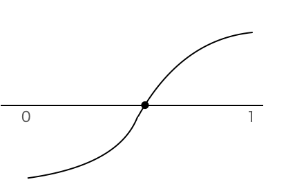

<v-clicks>

- 中間値の定理より, $f(x)=0$ を満たす$x$は存在する.
- 計算量の設定: $y\mapsto f(y)$の計算は**仮想的に**1回の演算としてカウントする.

</v-clicks>

---
layout: top-title-two-cols
color: amber-light
ratio: 6:4
---

::title::

二分探索の中身

::left::

1. $f(1/2)>0$ かどうかを確認
   - そうであれば, 求めたい$x$は $0<x<1/2$ を満たす
   - そうでなければ $1/2\leq x<1$ がわかる

<v-click>

2. $f(1/4)>0$ かどうか確認
   - そうであれば, 求めたい$x$は $0<x<1/4$ を満たす
   - そうでなければ $1/4\le x \le 1/2$

</v-click>

<v-click>

- 探索区間の中点での$f$の符号を見れば, 探索区間が半分にできる
- これを$n$回繰り返すと **探索区間の幅が$2^{-n}$** になる.
   - 区間の中央の点 $y$を出力すれば, $\abs{x-y}\le 2^{-n}$ を満たす.
   - $x$に十分近い値が計算できたことになる (**数値的求解**)

</v-click>

::right::

  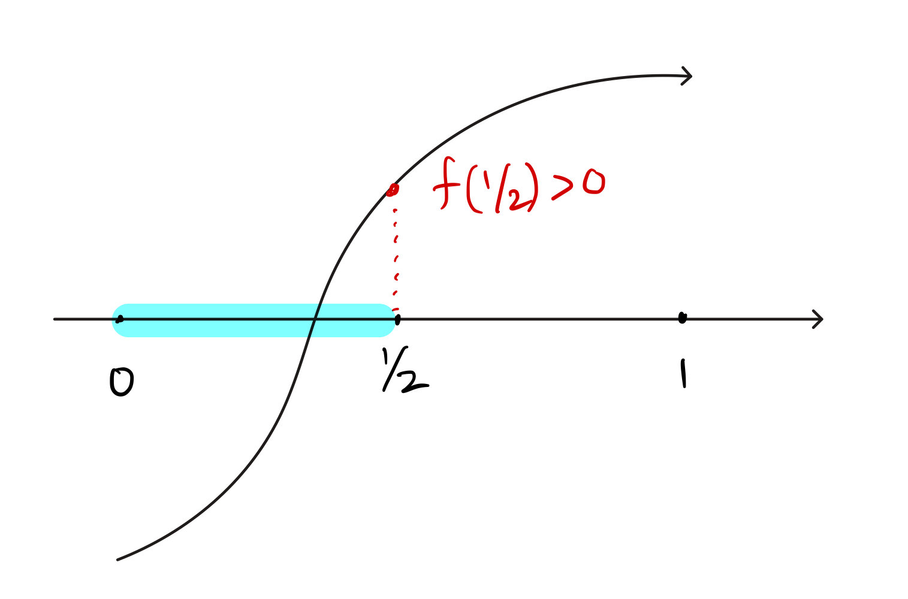

  

  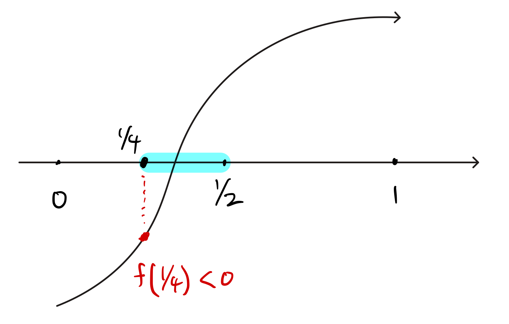
  

---
layout: top-title
color: amber-light
---

::title::

# 二分探索の記述

::content::

$A(n)$: 二分探索を$n$回反復し, 解$x$の近似値$\hat{x}$を出力する

1. $\ell = 0$, $r = 1$ で初期化する // 探索区間$[\ell,r]$の初期化
2. 各 $i=1,\dots,n$に対して以下の操作を行う:
   - $m = (\ell+r)/2$ とする
   - $f(m) > 0$ ならば, $\ell\leftarrow m$ // “$\leftarrow$"は値を書き換える操作を意味する
   - $f(m) \le 0$ ならば, $r\leftarrow m$
3. $(\ell+r)/2$ を出力して終了

<v-click>

- このように, アルゴリズムの動作を我々が使う言葉で記述したものを**疑似コード**という.
- 疑似コードには厳密な文法はないので, Pythonなどと同様に$\leftarrow$を$=$で書く人もいる

</v-click>

---
layout: top-title
color: amber-light
---

::title::

# 数値的な求解とは?

::content::

- 二分探索は, 式や記号として$x$を表すのではなく, 数値の**近似値**を求める
  - 記号で表す: $\log_2 3$, $\sqrt{2}$ など (**閉形式**)
  - $x=3.1415926536$ は$\pi$の近似値
  
<v-clicks>  

- コンピュータ内では$\sqrt{2}$や$\pi$など無理数の桁は全ては記憶できないので, **有限桁で打ち切って管理する**
  - 例えばPythonのfloat型だと数値は(二進数で)上位17桁くらいが保持される
- 今回の設定 ($f(x)=0$を満たす$x$) では, $x$を十分大きな桁数まで近似したい

入力として $n\in\Nat$ を受け取り, $f(x)=0$を満たす $x$ の小数点以下 $n$ 桁までの近似値を求めよ.

</v-clicks>

---
layout: top-title
color: amber-light
---

::title::

# 二分探索の理論保証

::content::

二分探索を使うと, $f(x)=0$を満たす$x$の小数点以下$n$桁を $O(n)$ 回の$f$の評価で求められる.

- 証明の概略
  - 二分探索をの反復を$4n$回繰り返すと, 探索区間の幅は$2^{-4n} < 10^{-n}$になる
  - よって, 探索区間の中央の点$y$を出力すれば, $\abs{x-y}<10^{-n}$が成り立つ

<v-click>

今回の問題設定では, $f(x)$の評価が一回の演算としてカウントしている.
これは, 関数$f$の値を瞬時に計算する**仮想的な機械**があると考えて計算量を考えている.
このように, アルゴリズムの計算量を考える際に仮想敵な機械を考えることはよくあり,
そのような機械を **オラクル(神託)** という.

オラクル: 神のお告げの意

</v-click>

---
layout: top-title
color: amber-light
---

::title::

# 二分探索の応用例: 平方根の計算

::content::

- 第一回講義: 足し算や掛け算の効率的な求め方
- では, $\sqrt{2}$や $\log_2 3$ はどうやって計算する?

$\sqrt{2}$と $\log_2 3$ を小数点以下$n$桁まで求めよ ($n$は入力で与えられる).

<v-clicks>

- $f(x)=x^2-2$に対して, $f(x)=0$ の解 $x$ を計算すればよい
- $f(x)=2^x-3$に対して, $f(x)=0$ の解 $x$ を計算すればよい
  - $f(2)=1$なので, 探索区間の幅は $[0,2]$ からスタートする
  

なお, 実用上はCPU内に平方根を計算する命令(FSQRT)があり, その内部では**ニュートン法**と呼ばれるアルゴリズムが使われている.

</v-clicks>

---
layout: top-title
color: amber-light
---
::title::

# 二分探索の応用例: 3SUM問題

::content::

二分探索で非自明なアルゴリズムが設計できる例として **3SUM問題** がある.

$n$個の整数 $a_1,a_2,\ldots,a_n \in \mathbb{Z}$ が与えられる.
これらの中に, $a_i+a_j+a_k=0$ を満たす相異なる3つの整数が存在するかどうかを判定せよ (ただし $i<j<k$).

<v-clicks>

- 入力のサイズを $n$ とする
- 自明なアルゴリズム: $O(n^3)$ 時間で全探索
  - $i,j,k$の3重ループを回す
- 二分探索: **$O(n^2\log n)$ 時間**で解ける
  - もうちょっと工夫すると実は $O(n^2)$ 時間で解ける
  - 現在のワールドレコード: $O(n^2/(\log n)^2)$ くらい \[Chan, 2020\]
  
</v-clicks>

---
layout: top-title
color: amber-light
---

::title::

# 二分探索を使った解き方

::content::

1. 与えられた整数列を昇順に並び替える (**ソート**)
   - つまり, $a_1 \le a_2 \le \dots \le a_n$ とする
   - これは $O(n\log n)$ 時間でできる (**マージソート**や**クイックソート**など)
   
<v-clicks>

2. 全ての$1\le i<j\le n$ に対して以下の操作を行う:
   - $[a_{j+1},\dots,a_n]$ の中に $-a_i-a_j$ が含まれているかどうかを確認する
     - これは**二分探索**を使うと $O(\log n)$ 時間でできる (後述)
   - もし $-a_i-a_j$ が含まれていれば, 答えはYes. 最終的に見つからなかったらNo.

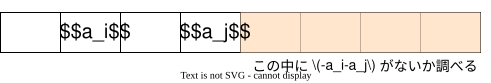

各$i,j$に対して$O(\log n)$時間かけているので, 全体の計算量は $O(n^2\log n)$

</v-clicks>

---
layout: top-title
color: amber-light
---

::title::

# 二分探索を使った解き方 (cont'd)

::content::

残りのTODO: 数列$(a_{j+1},\dots,a_n)$の中に, $b:=-a_i-a_j$があるかどうかを高速に判定せよ.

- ババ抜きでカードを引いたときの重複確認を思い出そう:

- 手元に$(a_{j+1},\dots,a_n)$のカードがあり, 新たに $b$ のカードを引いたとする

---
layout: top-title
color: amber-light
---

::title::

# 二分探索を使った解き方 (cont'd)

::content::

残りのTODO: 数列$(a_{j+1},\dots,a_n)$の中に, $b:=-a_i-a_j$があるかどうかを高速に判定せよ.

<v-click>

- 探索区間を $[\ell,r]:=[j+1,n]$ で初期化
- 中点 $m = \lfloor\frac{\ell+r}{2}\rfloor$ に対し, $a_m$ と $b$ の大小を比較:
  - $b < a_m$ なら, 探索区間を $[\ell,m-1]$ に更新
  - $a_m < b$ なら, 探索区間を $[m+1,r]$ に更新
  - $a_m = b$ なら, $a$の中に$b$が見つかったので答えはYes

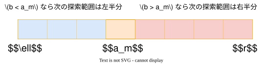

</v-click>

<v-click>

- 探索区間は半分ずつになるので, $O(\log n)$ 回後には幅2以下 -> 区間内に$b$があるかはすぐにわかる

</v-click>

---
layout: top-title
color: amber-light
---

::title::

# 疑似コード

::content::

$A(a_1,\dots,a_n)$: $n$個の整数を入力として受け取り, 3SUMの答えを出力する

1. ソートして$a_1\le \dots \le a_n$ となるように並び替える
2. 各$1\le i < j \le n$ に対して以下を実行する:
    - 以下の操作を$r-\ell\le 1$になるまで実行する:  反復回数は$O(\log n)$で抑えられる 
      - $\ell=j+1$, $r=n$で初期化し, $m=\lfloor\frac{\ell+r}{2}\rfloor$, $b = -a_i - a_j$ とする
      - $b < a_m$ ならば, $r\leftarrow m-1$に更新
      - $b > a_m$ ならば, $\ell\leftarrow m+1$に更新
      - $b = a_m$ ならば, Yesを出力して終了
    - $a_\ell=b$ または $a_r = b$ ならば, Yesを出力して終了
3. Noを出力して終了

---
layout: top-title-two-cols
color: amber-light
---

::title::

二分探索のまとめ

::left::

アイデアは単純:

1. 探索区間の初期化
2. 中点で大小関係を確認
3. 結果に応じて探索区間を左右どちらかの半分に更新

- **単調性** ($f$の単調増加性や配列の昇順性など) が必要
- 様々なアルゴリズムで暗に使われることが多い

<v-click>

探索空間を効率的に削減する方針はとても重要!

</v-click>

::right::

  
  

---
layout: section
color: amber-light
---

# 最適化とは?

---
layout: top-title
color: amber-light
---
::title::

# 最適化問題とは?

::content::

- 生成AIの学習, YouTubeのおすすめ動画, Amazonの関連商品, 交通機関の経路選択, インターネット通信などの背景では**最適化**問題を解くアルゴリズムが動いている.

<v-clicks>

関数 $f(x) = 2x^2 + 4x+3$ の $1\le x\le 100$ における最大値を求めよ.

- $x$の候補は**無限個**ある
- 微分して$0$になる点, 区間の端点での$f(x)$を比較すればよい (**探索空間を絞り込める**)

関数 $f(x_1,x_2) = 2x_1^2 + 4x_1x_2 + 3x_2$ の $1\le x_1,x_2\le 100$, $x_1,x_2\in\Int$ における最大値を求めよ

- $(x_1,x_2)$の候補は**有限個**(高々$10000$)なので原理的には, しらみ潰しできる (**全探索**)
- 候補が離散的なので, 微分して解けるとは限らない (**探索空間が絞りにくい**)

</v-clicks>

---
layout: top-title
color: amber-light
---
::title::

# 最適化問題とは?

::content::

**最適化問題**とは, 関数$f\colon \Omega\to \Real$ と$\Omega$の部分集合$S\subseteq \Omega$に対して **$\max_{x\in S} f(x)$** および, この**最大値を達成する$x\in S$** を求めよという問題である.

- 関数 $f$ を**目的関数** といい, $x \in \Omega$ を**解** という
- $S$ を記述する条件を**制約**といい, $x\in S$を **実行可能解** という
- $\max_{x\in S}f(x)$を**最適値**と呼び, 最適値を達成する$x\in S$を**最適解**という

<v-clicks>

- 最大化の代わりに最小化を考えることもある ($-f$の最大化 $\iff$ $f$の最小化)
- 一般に制約というと, 集合$S$そのものではなく, **$S$が満たす条件を記述する不等式など**を指すことが多い

</v-clicks>

---
layout: top-title
color: amber-light
---

::title::

# 最適化問題の例

::content::

<v-clicks>

関数 $f(x) = 2x^2 + 4x+3$ の $1\le x\le 100$ における最大値を求めよ.

- 制約: $1\le x$ と $x\le 100$ (二つの制約)
- 実行可能解の集合 $S = \cbra{ x\in \Real \colon 1\le x\le 100 }$

関数 $f(x_1,x_2) = 2x_1^2 + 4x_1x_2 + 3x_2$ の $1\le x_1,x_2\le 100$, $x_1,x_2\in\Int$ における最大値を求めよ

- 目的関数: $f(x_1,x_2) = 2x_1^2 + 4x_1x_2 + 3x_2$
- 制約: $1\le x_1,x_2\le 100$, $x_1,x_2\in\Int$ ($x_1,x_2$それぞれに三つずつ条件があるので, 六つの制約)

</v-clicks>

---
layout: top-title
color: amber-light
---

::title::

# 連続最適化と組合せ最適化

::content::

- 先の二つの例では, 連続的な制約と離散的な制約を考えた
  - 連続的な制約: $1\le x\le 100$ -> 実行可能解は非加算無限にあるが, $f$が微分できれば解きやすい
  - 離散的な制約: $1\le x_1,x_2\le 100$, $x_1,x_2\in\Int$ -> 実行可能解は加算だが, 候補が絞りにくい
  
<v-click>

- **連続最適化**: 連続的な制約上での最適化
- **組合せ最適化**: 離散的な制約上での最適化 (**離散最適化**と呼ぶこともある)

組合せ最適化であっても, $x\in\Int$という制約を考えると実行可能解が無限に存在することになるが,
ほとんどの場合は実行可能解が有限個しかない問題を考える.

</v-click>

---
layout: top-title
color: amber-light
---

::title::

# 離散最適化の面白い例

::content::

大岡山駅から神保町駅への電車で最も早く着ける経路を求めよ.

- 組合せ最適化問題とみなせる
  - 目的関数: 乗車時間
  - 制約条件: 大岡山駅発 かつ 神保町駅着

<v-click>

- 理論上は(遠回りも許せば)非常に多くの実行可能解が存在
  - 大岡山 $\underset{\tiny{\text{目黒線}}}{\rightarrow}$ 目黒 $\underset{\tiny{\text{三田線}}}{\rightarrow}$ 神保町
  - 大岡山 $\underset{\tiny{\text{目黒線}}}{\rightarrow}$ 目黒 $\underset{\tiny{\text{山手線}}}{\rightarrow}$ 渋谷 $\underset{\tiny{\text{半蔵門線}}}{\rightarrow}$ 神保町
  - 大岡山 $\underset{\tiny{\text{大井町線}}}{\rightarrow}$ 大井町 $\underset{\tiny{\text{京浜東北線}}}{\rightarrow}$ 田町(三田) $\underset{\tiny{\text{三田線}}}{\rightarrow}$ 神保町
  - 大岡山 $\underset{\tiny{\text{大井町線}}}{\rightarrow}$ 溝の口 $\underset{\tiny{\text{田園都市線}}}{\rightarrow}$ 長津田 $\underset{\tiny{\text{横浜線}}}{\rightarrow}$ 八王子 $\underset{\tiny{\text{中央線}}}{\rightarrow}$ 御茶ノ水 $\underset{\tiny{\text{丸の内線}}}{\rightarrow}$ 大手町 $\underset{\tiny{\text{三田線}}}{\rightarrow}$ 神保町

</v-click>

---
layout: section
color: amber-light
---

# 貪欲法

---
layout: top-title
color: amber-light
---

::title::

# 貪欲法とは?

::content::

貪欲法とは, **逐次的に最善の手を選んで解を構成する**というアルゴリズムの考え方である.

<v-clicks>

- ほとんどの場合は**組合せ最適化問題に適用される**アプローチ
- 必ずしも最適解が得られるとは限らない
  - 一定の条件下では最適解が得られる (**マトロイド**)
- ただし, 実用上は多くの場合で最適解に非常に近い解が得られる

貪欲法の特徴:

- 単純なので実装が簡単かつ高速
- 必ずしも最適解が得られるとは限らない

</v-clicks>

---
layout: top-title
color: amber-light
---

::title::

# 硬貨支払い枚数最小化問題

::content::

$M$円ちょうどを現金(日本円)で支払う方法の中で**硬貨**の個数を最小化せよ (紙幣は考えない)

<v-clicks>

- 例: $M=436$のときの最適解は$100\times 4 + 10\times 3 + 5\times 1 + 1\times 1$ (計9個).
  - 他にも$1$円を$430$枚使って払う方法も実行可能解の一つ

- 例: $M=10000$のとき, 最適解は500円玉20枚 (紙幣は考えないため)

日常的な感覚: 大きい硬貨から出していく (=貪欲法)

- $436$円の場合:
  - $436$以下で最大の貨幣は100円 -> 100円玉を $\lfloor 436 / 100\rfloor = 4$枚だして, 残り36円
  - $M=36$に対して**再帰的**に解く ($M=0$になったら終了)
  
</v-clicks>

---
layout: top-title
color: amber-light
---

::title::

# 組合せ最適化問題としての記述

::content::

$$
\begin{aligned}
    &\text{minimize} && x_1 + x_5 + x_{10} + x_{50} + x_{100} + x_{500} \\
    &\text{subject to} && x_1 + 5x_5 + 10x_{10} + 50x_{50} + 100x_{100} + 500x_{500} = M \\
    &&& x_1,\, x_5,\, x_{10},\, x_{50},\, x_{100},\, x_{500} \in \mathbb{Z}_{\geq 0}
\end{aligned}
$$

- 最小化問題を考えている
- subject to (〜に属する) は s.t. と略されることもある

---
layout: top-title
color: amber-light
---

::title::

# アルゴリズムの記述

::content::

$A(M)$: 入力として $M$ を受け取って, 最適な支払い方を出力するアルゴリズム

1. 各 $c=500,100,50,10,5,1$の順番で以下を実行する:
   - $k= \lfloor M/c\rfloor$ とし, 「$c$円玉を$k$枚払う」と出力する
   - $M\leftarrow M - ck$ に更新する

- 例えば$M=436$, $c=500$のとき, $k=0$なので「500円玉を$0$枚払う」と出力される
- 実際に我々が現金で支払う時の脳内で走らせてるアルゴリズムを記述している
- 常に, 支払える硬貨の中で最大のものをできるだけ使うので貪欲法といえる

---
layout: top-title
color: amber-light
---

::title::

# 最適性保証

::content::

貪欲法のアルゴリズム$A(M)$の出力は, 硬貨支払い枚数最小化問題に対する最適解を出力する.

<v-clicks>

証明の方針
- 例えば, 300円を無駄に多くの硬貨を使って支払ったとき, より少ない枚数を使う等価な支払い方法に変換できることを示す:

  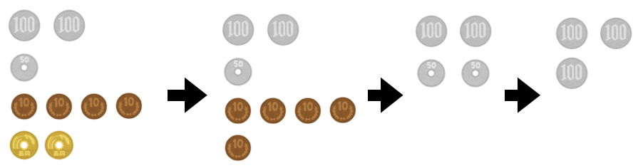

- 最終的に得られたものは貪欲法$A(M)$の出力と一致することを確認すればよい

</v-clicks>

---
layout: top-title
color: amber-light
---

::title::

# 最適性保証

::content::

貪欲法のアルゴリズム$A(M)$の出力は, 硬貨支払い枚数最小化問題に対する最適解を出力する.

証明 (1/3)

<v-clicks>

- アルゴリズム$A(M)$が「$1$円玉を$k_1$枚, $5$円玉を$k_5$枚, ..., $500$円玉を$k_{500}$枚払うと出力したとする
  - これをベクトルとして, $A(M)=(k_1,k_5,k_{10},k_{50},k_{100},k_{500})$で表すことにする
- 最適解の一つを$(k^*_1,k^*_5,\dots,k^*_{500})$とする
  - 必ず$k^*_1\ge 5$とすると, 1円玉を5枚以上使っており, これらを5円玉に置き換えることでより少ない枚数で支払えてしまい, 最適解であることに矛盾する. 従って **$k^*_1\le 4$**.
  - 同様の議論で $k^*_5\le 1,k^*_{10}\le 4,k^*_{50}\le 1,k^*_{100}\le 4$ となる.
- このことから, **$k^*_1+5k^*_5+10k^*_{10}+50k^*_{50}+k^*_{100} \le 499$** が成り立つ

</v-clicks>

---
layout: top-title
color: amber-light
---

::title::

# 最適性保証

::content::

貪欲法のアルゴリズム$A(M)$の出力は, 硬貨支払い枚数最小化問題に対する最適解を出力する.

証明 (2/3)

<v-clicks>

- 次に **$k^*_{500} = \lfloor M/500 \rfloor$** を示す. 矛盾を導くため, 以下では $k^*_{500} < \lfloor M/500 \rfloor$を仮定する.
  - このとき, $k^*_{500}\le M/500-1$より, **$500k^*_{500}\le M - 500$**.
- 支払う合計金額は$M$に一致するため
  $$
      k^*_1+5k^*_5+10k^*_{10}+50k^*_{50}+100k^*_{100}+500k^*_{500} = M.
  $$
- 両辺から $500k^*_{500}$を引くと
  $$
      k^*_1+5k^*_5+10k^*_{10}+50k^*_{50}+100k^*_{100} = M - 500k^*_{500} \ge 500.
  $$
- 左辺は$499$以下だったので矛盾

</v-clicks>

---
layout: top-title
color: amber-light
---

::title::

# 最適性保証

::content::

貪欲法のアルゴリズム$A(M)$の出力は, 硬貨支払い枚数最小化問題に対する最適解を出力する.

証明 (3/3)

<v-clicks>

- **$k^*_{500} = \lfloor M/500 \rfloor$** が示されたが, これは貪欲法$A(M)$が出力する$k_{500}$に一致している.
- 残った金額 $M'=M - 500k^*_{500}$ に対して, 同様の議論で **$k^*_{100}=\lfloor M'/100\rfloor$** が成り立つ
  - この値 $k^*_{100}=\lfloor M' / 100 \rfloor$ は$A(M)$が出力する$k_{100}$に一致する
- 以下これを繰り返すと, 最適解は確かに$A(M)$の出力と一致している.

</v-clicks>

---
layout: section
color: amber-light
---

# 勾配法

---
layout: top-title
color: amber-light
---

::title::
# 勾配法とは?

::content::

連続最適化を解くアルゴリズム. 「AIが学習する」＝「勾配法を走らせる」

$$
\begin{aligned}
    &\text{minimize} && f(x) \\
    &\text{subject to} && x \in \mathbb{R}^n
\end{aligned}
$$

<v-click>

アルゴリズムの大雑把なイメージ:

1. 初期点 $x_0\in\Real^n$ を決める
2. 各 $t=0,1,\dots$ に対し, $f(x_t)$が**最も降る方向**に$x$を動かして, $x_{t+1}\leftarrow x_t$ とする
3. 十分$f(x)$が降ったら, その時点での$x$を出力して終了

- $\sqrt{2}$の計算と同様, 数値的求解を目指す

 一次元では傾きの符号で移動の方向を決める 

</v-click>

---
layout: top-title-two-cols
color: amber-light
---

::title::

勾配法とは?

::left::

- 貪欲法と似た発想 (今とれる最も良い手を選び続ける)

<v-clicks>

- 勾配法では, $f$の **勾配 $\nabla f(a)$** を使って計算する

    $$
      \begin{align*}
        \nabla f(a) = \rbra{\frac{\partial f}{\partial x_1}(a),\dots,\frac{\partial f}{\partial x_n}(a)}
      \end{align*}
    $$
  - $\nabla f$ は関数 $\nabla f \colon \Real^n \to \Real^n$ とみなす
  - $f$ の微分可能性は常に仮定
- 勾配法のアイデア: 傾きとは逆方向に進めば下れる
  - つまり, **$x_{t+1} \leftarrow x_t - \eta\cdot \nabla f(x_t)$** と更新すればよい! ($\eta>0$は適当なパラメータ)
  
</v-clicks>

::right::

  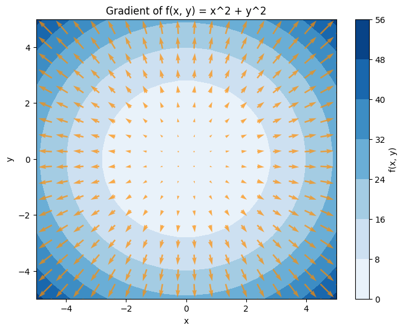
  

    矢印の向きに進むと関数値が大きくなっていく
  

---
layout: top-title
color: amber-light
---

::title::
# 勾配法の記述

::content::

$A(x_0,\eta,\varepsilon)$ は各 $t=0,1,2,\dots$に対して以下を実行する:
1. 点 $x_t$ における勾配 $\nabla f(x_t)$ を計算する
2. $x_{t+1} \leftarrow x_t - \eta\cdot \nabla f(x_t)$ を計算する
3. もし$\norm{x_{t+1} - x_t} \le \varepsilon$ ならば, $x_{t+1}$を出力して終了する. そうでなければ$t$を1増やしてステップ1に戻る

- $\norm{a}=\sqrt{\sum_{i=1}^n a_i^2}$ はユークリッドノルム
- $x$の動き幅が十分小さくなったら終了
- パラメータ $\eta>0$ を**ステップサイズ**または**学習率**と呼ぶ

---
layout: top-title
color: amber-light
---

::title::

# 勾配法の動作例

::content::

  

    <video controls style="max-width: 100%; height: auto;">
      <source src="./images/GD1d.mp4" type="video/mp4">
      お使いのブラウザは動画タグをサポートしていません。
    </video>
    

      一次元での勾配法の動作例 (ステップサイズが小さい)
    

  

  
  

    <video controls style="max-width: 100%; height: auto;">
      <source src="./images/GD1d-osc.mp4" type="video/mp4">
      お使いのブラウザは動画タグをサポートしていません。
    </video>
    

      ステップサイズが大きい場合は飛び越えることもある
    

  

---
layout: top-title
color: amber-light
---

::title::
# 勾配法の動作例 (続き)

::content::

  

    <video controls style="max-width: 100%; height: auto;">
      <source src="./images/GD1d-slow.mp4" type="video/mp4">
      お使いのブラウザは動画タグをサポートしていません。
    </video>
    

      ステップサイズが大きすぎると収束が遅くなる
    

  

  
  

    <video controls style="max-width: 100%; height: auto;">
      <source src="./images/GD1d-div.mp4" type="video/mp4">
      お使いのブラウザは動画タグをサポートしていません。
    </video>
    

      さらに大きいと発散してしまう
    

  

---
layout: top-title
color: amber-light
---

::title::

# 最適性の保証

::content::

- **凸**関数 $f$ が **良い性質を持つ** ならば, ステップサイズ $\eta$ を十分小さいならば, 勾配法は **最適解** に収束する

<v-click>

関数 $f\colon \Real^n \to \Real$ が **凸** であるとは, 任意の $x,y\in\Real^n$ および $0\le \lambda \le 1$ に対して
$$
    f(\lambda x + (1-\lambda)y) \le \lambda f(x) + (1-\lambda)f(y)
$$
が成り立つことをいう.

  

    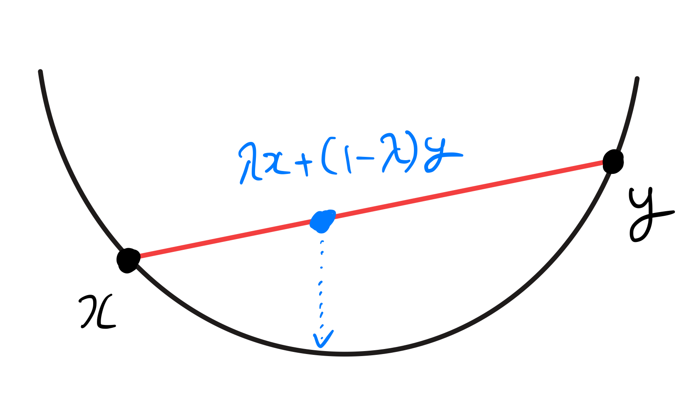
    
凸関数

  

  

    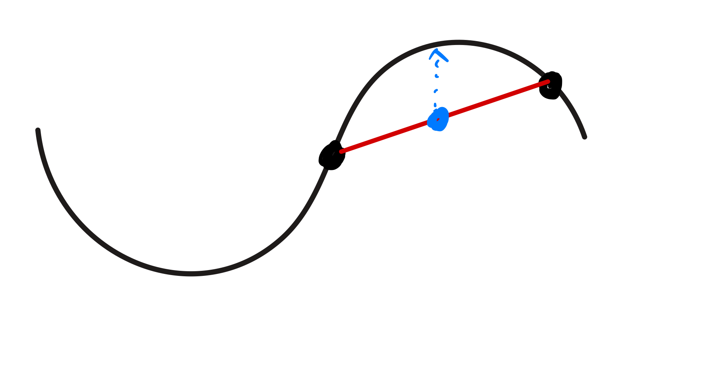
    
非凸関数

  

</v-click>

---
layout: top-title
color: amber-light
---

::title::
# 最適性の保証

::content::

- $f$ が凸じゃないとき, 勾配法は最適解に収束しないことがある

  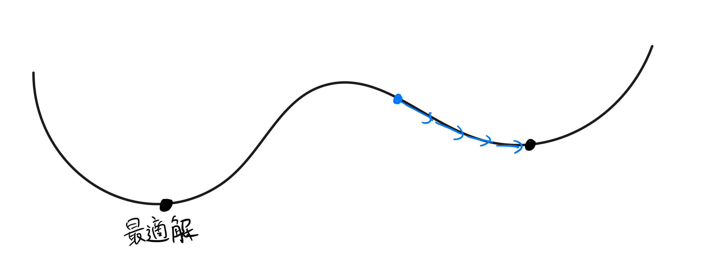
  

    非凸関数では「谷」が複数あり、勾配法は最適でない局所解に留まる場合がある
  

<v-click>

勾配法の収束性を議論する場合は, 考える関数$f$の凸性が大前提

</v-click>

---
layout: top-title
color: amber-light
---

::title::
# 最適性の保証

::content::

関数 $g\colon \Real^n \to \Real^n$ が **$L$-リプシッツ** であるとは, 任意の $x,y\in\Real^n$ に対して
$$
    \norm{g(x) - g(y)} \le L\norm{x-y}
$$
が成り立つことをいう ($\norm{v}=\sqrt{\sum_{i=1}^n v_i^2}$ はユークリッドノルム).

- 「$(x,g(x))$ と $(y,g(y))$ を結ぶ直線の傾きが $L$ 以下」という意味

  

    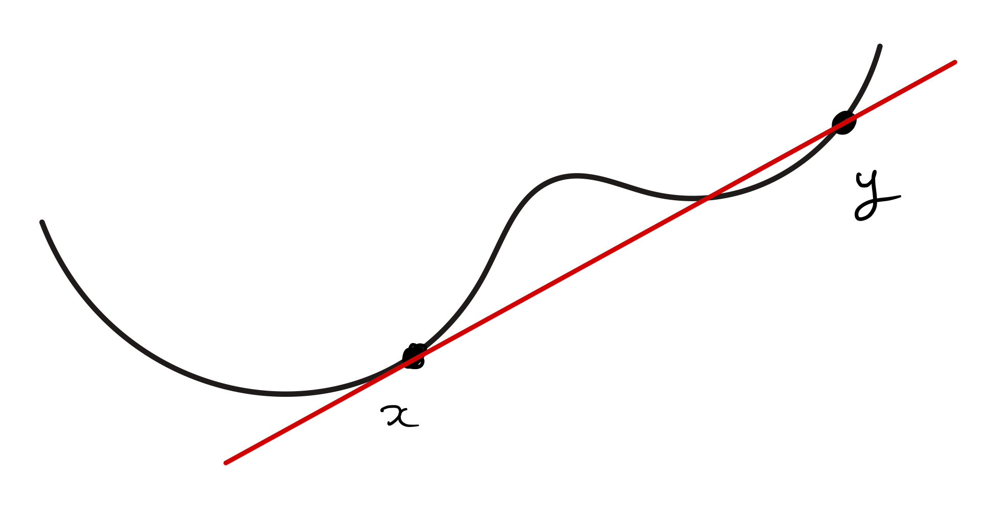
  

  

    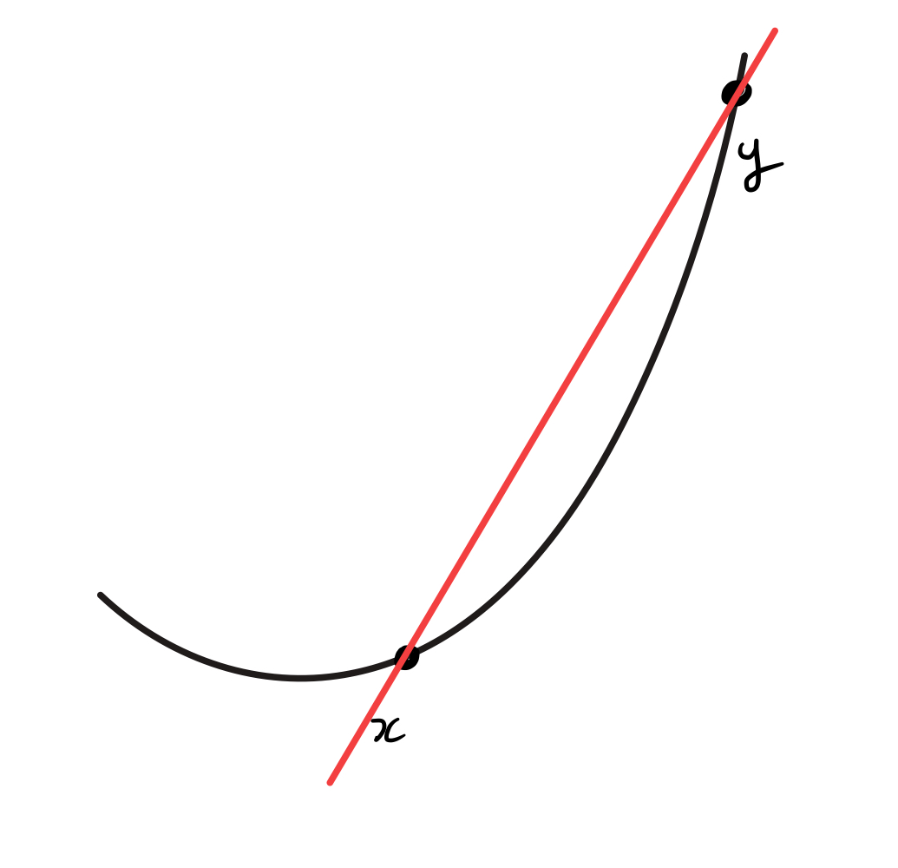
  

---
layout: top-title
color: amber-light
---

::title::
# 最適性の保証

::content::

二回微分可能な**凸**関数 $f$ は, **$\nabla f$ が $L$-リプシッツ**ならば, ステップサイズ　$0< \eta \le \frac{1}{L}$ を用いた勾配法は, 任意の初期点 $x_0$ から始めると最適解に収束する.

具体的には, 初期点 $x_0$ から開始し, 最適解を $x^*$ とすると, $t$ 回の反復で得られる $x_t$ は以下を満たす:

$$
  \begin{align*}
    f(x_t) \le f(x^*) + \frac{\norm{x_0 - x^*}^2}{2\eta t}
  \end{align*}
$$

- 意味: 傾きが急激に変化しない (=$\nabla f$がリプシッツ) ならば, 勾配法は小さい $\eta$ で収束
- $t\to \infty$ にすると, 右辺は最適値 $f(x^*)$ 収束する

---
layout: top-title
color: amber-light
---

::title::
# 今日のまとめ

::content::

- 二分探索
  - 探索空間を効率的に減らし続けることが肝要
- 最適化問題の概念
  - 連続最適化と組合せ最適化
- 貪欲法
  - 最も単純なアプローチだが, 最適解が得られるときもある
- 勾配法
  - 性質のよい$f$ならば高速に最適に近い解が得られる