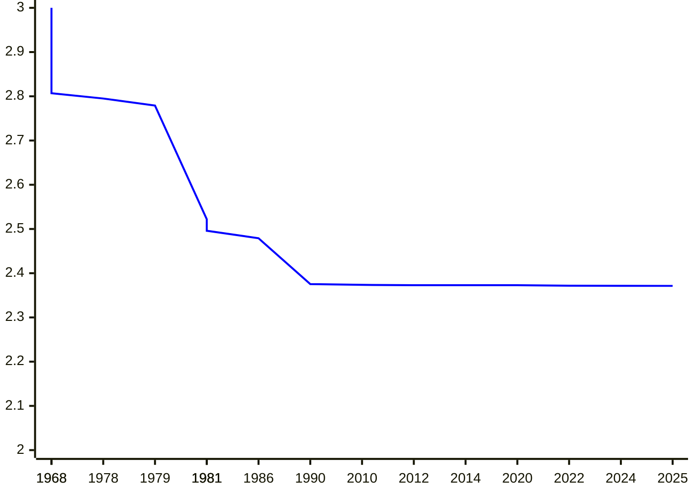
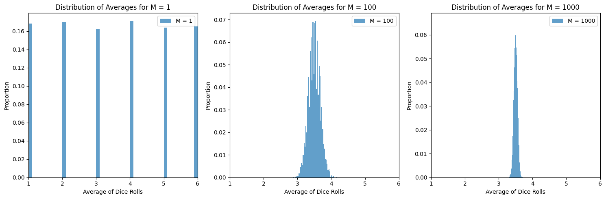
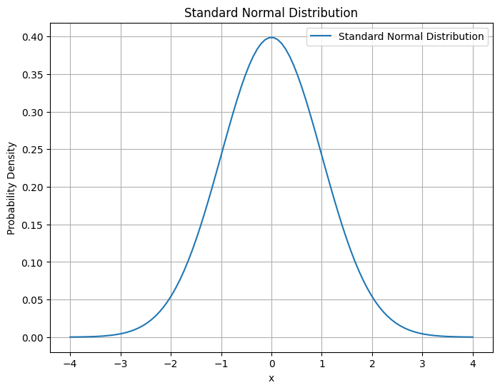
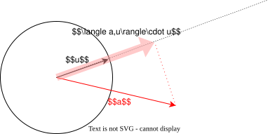

# プログラミング応用 第3回: <br> 乱択アルゴリズム

[清水 伸高](https://sites.google.com/view/nobutaka-shimizu/home) (塩浦研 助教)

<div style="position: absolute; bottom: 20px; font-size: 0.8em; width: 100%; text-align: center;">
2025年 10月21日
</div>

---
layout: top-title
color: amber-light
---

::title::
# 内容: 乱択アルゴリズムとその応用

::content::

1. [乱択アルゴリズムとは?](/3)
   - [Freivaldsのアルゴリズム](/14)
   - [多項式同一性判定](/18)
2. [確率集中不等式](/26)
   - [Hoeffdingの不等式](29)
3. [Johnson-Lindenstraussの次元削減](34)
   - [正規分布](/44)

  
---
layout: section
color: amber-light
---

# 乱択アルゴリズムとは?

---
layout: top-title
color: amber-light
---

::title::
# 乱択アルゴリズム

::content::

- 乱択アルゴリズム: 実行時に**乱数を利用する**アルゴリズム
  - 入力が同じでも, **実行するたびに異なる結果が得られる**可能性がある
  - 運が悪いと誤った結果を返すこともある (失敗)

<div class="question">

  じゃあ, 乱数を使うと何が良いの?

</div>

<v-clicks>

-  乱数が使った方が**シンプルかつ高速**な場合がある
-  乱択アルゴリズム (ランダムウォークなど) の理論には様々な応用がある
   -  ページランク (Googleの検索アルゴリズム)
   -  焼きなまし法　(マルコフ連鎖モンテカルロ法)
   -  **Johnson-Lindenstraussの次元削減** <- 今日扱う
  
</v-clicks>


---
layout: top-title
color: amber-light
---

::title::

# 4SUM

::content::


<div class="question">

  与えられた整数の集合 $A=\{a_1,a_2,\ldots,a_n\}$ に対し, ある $i<j<k<l$ が存在して $a_i+a_j+a_k+a_l=0$ となるか?  

</div>

<v-clicks>

- 前回の講義: 3SUM問題 ($a_i+a_j+a_k=0$ の存在性判定) は $O(n^2\log n)$ 時間で解ける
- 前回の演習問題: **四つの集合 $A_1,A_2,A_3,A_4$ に分割されているバージョン**は $O(n^2\log n)$ 時間で解ける

<div class="algorithm">

アルゴリズムの概要:
  1. $A_1+A_2:=\{a_1+a_2\colon a_1\in A_1,a_2\in A_2\}$ を昇順にソート (**$O(n^2\log n)$時間**)
  2. 各 $a_3\in A_3, a_4\in A_4$ に対し, $-(a_3+a_4)$ が $A_1+A_2$ に含まれるか二分探索 (**$O(n^2\log n)$時間**)

</div>

- これを上記の4SUMに適用するとどうなるか?

</v-clicks>

---
layout: top-title
color: amber-light
---

::title::
# 4SUM

::content::

<div class="algorithm">

分割されていない4SUMに対する二分探索の案
  1. $A+A:=\{a_i+a_j\colon a_i\in A,a_j\in A\}$ を昇順にソート
  2. 各 $k<\ell$ に対し, $-(a_k+a_\ell)$ が $A+A$ に含まれるか二分探索

</div>

<v-clicks>

- ステップ2で実際に $-(a_k+a_\ell)$ が含まれていたとする
  - このとき, $-(a_k+a_\ell)=a_i+a_j$ となる $i<j$ が存在する
  - しかし, **$i,j,k,\ell$ は全て相異なるとは限らない** (もしかしたら $i=k$ かもしれない)
  
- インデックスの重複が起きうるので, もう少し工夫した二分探索の実装が必要
  - $A+A$の計算時に $(a_i+a_j,i,j)$を全てメモしておく + 二分探索の区間更新の工夫
  - 正直、面倒... 😩
  
</v-clicks>

---
layout: top-title
color: amber-light
---

::title::
# 4SUMに対する乱択アルゴリズム

::content::

- 乱択を使うとかなり単純に解ける! 😊✨

<div class="topic-box">

アイデア: $A$ の要素をランダムに四つの集合 $A_1,A_2,A_3,A_4$ に分割して, 分割バージョンの4SUMを二分探索で解く.

</div>

<v-clicks>

- $a$の各要素に対して, 等確率で $A_1,A_2,A_3,A_4$ のどれかに振り分ける
- 元の集合 $A$ の答えがNoのとき:
  - どのように分割しても, 分割バージョンの答えも**必ず**No
- 元の集合 $A$ の答えがYesで, $a_i+a_j+a_k+a_\ell = 0$ のとき:
  - $a_i,a_j,a_k,a_\ell$ が**全て相異なるグループに属されれば**, 分割バージョンの答えはYesになる
  - この事象が発生する確率はどれくらい?
   
</v-clicks>

---
layout: top-title
color: amber-light
---

::title::

# 4SUMに対する乱択アルゴリズム

::content::

- $a_i,a_j,a_k,a_\ell$ が全て相異なるグループに属される確率は? -> 言い換えると以下の問題になる:

<div class="question">

  4つのボールを, 4つの箱にランダムに入れるとき, 4つのボールが全て異なる箱に入る確率は?

</div>

<v-clicks>

- 箱の入れ方の総数: $4^4=256$ 通り
- 4つのボールが全て異なる箱に入る場合の数: $4!=24$ 通り
- よって, 確率は $\frac{24}{256}=\frac{3}{32}$ -> **約9%** の確率で成功する
  - **繰り返し** によってこの確率を増幅させる

<div class="topic-box">

 一回の試行では9%の確率で分割されるので, 100回試行したときに**全て失敗する確率は $0.91^{100} < 0.001$**.
 つまり, 99.999%の確率で一度は $a_i,a_j,a_k,a_\ell$ 分割される. **一度でも成功したら, 正しく判定される.**

</div>

</v-clicks>

---
layout: top-title
color: amber-light
---

::title::
# 4SUMに対する乱択アルゴリズム (まとめ)

::content::

<div class="question">

  与えられた整数の集合 $A=\{a_1,a_2,\ldots,a_n\}$ に対し, ある $i<j<k<l$ が存在して $a_i+a_j+a_k+a_l=0$ となるか?  

</div>

<div class="algorithm">

入力として集合 $A$ とパラメータ $\delta>0$ を受け取る
  1. $A$ の各要素をランダムに $A_1,A_2,A_3,A_4$ に振り分ける
  2. 分割バージョンの4SUMを二分探索で解く
  3. ステップ1と2を $10\log_2(1/\delta)$ 回繰り返し, 一回でもYesが出たらYesを返す

</div>

- 時間計算量: $O(n^2\log n \log(1/\delta))$
- 誤答確率 (答えがYesなのにNoと答える確率) = $0.91^{\text{繰り返し回数}} \le (1/2)^{\log_2 (1/\delta)} \le \delta$.

---
layout: top-title
color: amber-light
---

::title::
# 行列積

::content::

<div class="question">

二つの行列 $A,B\in\Real^{n\times n}$ が与えられる. これらの積 $AB$ を計算せよ.

</div>

<v-clicks>

愚直な方法: $O(n^3)$ 時間

```python
def matrix_mult(A, B):
    """
    2つのn×n行列A, Bの積ABを計算して返す
    """
    n = len(A)
    C = [[0]*n for _ in range(n)]
    for i in range(n):
        for j in range(n):
            for k in range(n):
                C[i][j] += A[i][k] * B[k][j]
    return C
```

<div class="topic-box">

もっと高速にできるか?

</div>

</v-clicks>

---
layout: top-title
color: amber-light
---

::title::
# 行列積計算の歴史

::content::

- Strassenのアルゴリズム(1968)を皮切りに現在も改善が続いている
- **行列積指数 $\omega$**: 行列積を計算する$O(n^\omega)$時間アルゴリズムが存在する最小の$\omega$
  - $n^2$個の値を出力するので, 明らかに$\omega\ge 2$

<div style="display: flex; gap: 1em; font-size: 0.7em; border: 1px solid #ccc; padding: 0.5em; border-radius: 5px;">
<div>

| year | $\omega$ |  authors |
|:--:|:--|:--|
| 1968 | $2.807$ | [Strassen](https://link.springer.com/article/10.1007/BF02165411) |
| 1978 | $2.795$ | [Pan](https://ieeexplore.ieee.org/document/4567976) |
| 1979 | $2.779$ | [Bini, Capovani, Romani, Lotti](https://www.sciencedirect.com/science/article/pii/0020019079901133) |
| 1981 | $2.522$ | [Schönhage](https://epubs.siam.org/doi/10.1137/0210032) |
| 1981 | $2.517$ | [Romani](https://epubs.siam.org/doi/10.1137/0211020) |

</div>
<div>

|year | $\omega$ | authors |
|:--:|:--|:--|
| 1981 | $2.496$ | [Coppersmith, Winograd](https://ieeexplore.ieee.org/document/4568320) |
| 1986 | $2.479$ | [Strassen](https://ieeexplore.ieee.org/document/4568194) |
| 1990 | $2.3755$ | [Coppersmith, Winograd](https://www.sciencedirect.com/science/article/pii/S0747717108800132?via%3Dihub) |
| 2010 | $2.3737$ | [Stothers](https://era.ed.ac.uk/handle/1842/4734) |
| 2012 | $2.3729$ | [Williams](https://dl.acm.org/doi/10.1145/2213977.2214056) |

</div>
<div>

| year | $\omega$ | authors |
|:--:|:--|:--|
| 2014 | $2.3728639$ | [Le Gall](https://dl.acm.org/doi/10.1145/2608628.2627493) |
| 2020 | $2.3728596$ | [Alman, Williams](https://theoretics.episciences.org/14213) |
| 2022 | $2.371866$ | [Duan, Wu, Zhou](https://ieeexplore.ieee.org/document/10353208) |
| 2024 | $2.371552$ | [Williams, Xu, Xu, and Zhou](https://epubs.siam.org/doi/10.1137/1.9781611977912.134) |
| 2025 | $2.371339$ | [Alman, Duan, Williams, Xu, Xu, and Zhou](https://epubs.siam.org/doi/10.1137/1.9781611978322.63) |

</div>
</div>

<style>
th {
  background-color: #f0f0f0;
}
</style>

---
layout: top-title
color: amber-light
---

::title::
# 行列積計算の歴史

::content::

<div style="width: 55%; margin: 0 auto;">

</div>

<style>
th {
  background-color: #f0f0f0;
}
</style>

<v-click>

<div class="remark">

$\omega=2$ にできるかどうかは**とても重要な未解決問題** (2025年現在: $\omega\le 2.3714$)

</div>

</v-click>

---
layout: top-title
color: amber-light
---

::title::
# 行列積の検算

::content::

<div class="question">

三つの行列 $A,B,C\in\Real^{n\times n}$ が与えられる.
**$AB=C$かどうか**を判定せよ.

</div>

- $AB$を計算して$C$と比較 -> $O(n^\omega)$時間
- 積$AB$を計算せずに, 確認できるか? -> **Freivaldsのアルゴリズム**

<v-clicks>

 <div class="theorem">
 
  ある$O(n^2)$時間乱択アルゴリズム $M(A,B,C)$ が存在して, 
  - $AB=C$ ならば 確率$1$ でYesと出力
  - $AB\ne C$ ならば **確率$2/3$** でNoと出力
 
 </div>

 - **確率の増幅**: 同じ入力に対し$M$を繰り返し走らせると確率$2/3$をいくらでも$1$に近づけられる

</v-clicks>

---
layout: top-title
color: amber-light
---

::title::
# Freivaldsのアルゴリズム

::content::

<div class="topic-box">

アイデア: ランダムなベクトル $r\in \Real^n$ に対して, **$ABr = Cr$ かどうか**をチェック.

</div>

- 行列$\times$ベクトル の計算は $O(n^2)$時間でできる. よって$ABr=A(Br)$の計算も$O(n^2)$時間で可能

<v-clicks>

<div class="algorithm">

Freivaldsのアルゴリズム $M(A,B,C)$

1. ベクトル$r\in\{0,1\}^n$を, 各$r_i$を独立に確率$1/2$で$0$または$1$にする
2. もし$ABr = Cr$ ならば, Yesを出力する. そうでなければNoを出力する

</div>

- アルゴリズム$M$の計算時間は $O(n^2)$

</v-clicks>

---
layout: top-title
color: amber-light
---

::title::
# Freivaldsのアルゴリズム

::content::

<div class="theorem">

Freivaldsのアルゴリズム $M(A,B,C)$ は, $AB=C$ならば確率$1$でYesを出力し, $AB\ne C$ならば確率$1/2$でNoを出力する.

</div>

証明 (1/2)

<v-clicks>

- $AB=C$のとき, どの$r\in\{0,1\}^n$を選んでも必ず$ABr=Cr$が成り立つのでYesが出力される
- あとは$AB\ne C$のときを考えればよい
  - $ABr=Cr\iff (AB-C)r$ より, **$\Pr[(AB-C)r\ne 0]\ge 1/2$** を示せばよい
  - $AB-C\ne 0$は非ゼロの行ベクトル $v$ をもつ. これが第$i$行ベクトルであるとする
  - $(AB-C)r$の第$i$成分に着目する. この値は **$\langle v,r\rangle = \sum_{i=1}^n v_ir_i$** に等しい

</v-clicks>

---
layout: top-title
color: amber-light
---

::title::
# Freivaldsのアルゴリズム

::content::

<div class="theorem">

Freivaldsのアルゴリズム $M(A,B,C)$ は, $AB=C$ならば確率$1$でYesを出力し, $AB\ne C$ならば確率$1/2$でNoを出力する.

</div>

証明 (2/2)

<v-clicks>

- 一般に, 任意の非ゼロベクトル $v\in \Real^n$とランダムに選ばれた $r\in\{0,1\}^n$ に対し
  
  $$
    \begin{align*}
      \Pr\sbra{\sum_{i=1}^n v_i r_i \ne 0 } \ge \frac{1}{2}
    \end{align*}
  $$

  が成り立つ (証明は演習).
- 従って, $AB-C$の第$i$行ベクトル$v$が非ゼロのとき, 確率$\ge 1/2$で $(AB-C)r$の第$i$成分は非ゼロ
  - 以上より, $AB\ne C \Rightarrow \Pr[(AB-C)r\ne 0]\ge 1/2$が示された (証明終)
  
</v-clicks>

---
layout: top-title
color: amber-light
---

::title::
# 計算 vs. 検算

::content::

<div class="topic-box">

Freivaldsのアルゴリズムより, $AB$の**検証**($AB=C$かどうかの確認)は, $AB$そのものの**計算**よりも「はるかに簡単」であることが示唆される.

</div>

<v-clicks>

<div class="remark">

実際には, $O(n^2)$時間で$AB$を計算できるかもしれないので, **本当に「はるかに簡単」であるとは証明されていない**.
しかし, 近年の行列積アルゴリズムは非常に複雑なアルゴリズムなので, アルゴリズムの「単純さ」で言えば, 現状は検証の方がはるかに簡単であると考えられている.

</div>

- では, 行列積に限らず一般に **「計算」と「検証」には計算の難しさの意味でギャップは存在しうるのか?**
  - 推理小説は, 最初から読み進めていくと犯人やトリックを推測するのは難しい (計算が難しい)
  - 一方で, 名探偵の解説を聞くとその推理が正しいかの検証は容易 (検証は容易)
- この問いは概念的には **$\mathsf{P}$ vs. $\mathsf{NP}$問題** と呼ばれる世界最高レベルに難しい未解決問題の一つである

</v-clicks>

---
layout: top-title
color: amber-light
---

::title::
# 多項式同一性判定

::content::

<div class="question">

二つの $n$変数, 次数$d$ の多項式 $f,g\colon\Real^n\to\Real$ が**同一かどうか**を判定せよ.

</div>

<v-click>

<div class="definition">

- 関数 $f,g$ が同一 $\iff$ 全ての$x\in\Real^n$に対して$f(x)=g(x)$
- 多項式 $f(x_1,\dots,x_n)$の次数 $=$ 各項が高々$d$個の変数の積の定数倍になっているような最小の$d\ge 0$

</div>

<div class="example">

  - $f(x)=ax+b$ -> 項は **$ax$** と **$b$**. どの項も高々一次 (ただし $a\ne 0$)
  - $f(x_1,x_2)=x_1^2x_2-x_1x_2+2x_2^3$ -> 項は **$x_1^2x_2$** と **$-x_1x_2$** と **$2x_2^3$**. どの項も高々三次

</div>

</v-click>

---
layout: top-title
color: amber-light
---

::title::
# 多項式同一性判定

::content::

<div class="question">

二つの $n$変数, 次数$d$ の多項式 $f,g\colon\Real^n\to\Real$ が**同一かどうか**を判定せよ.

</div>

<div class="example">

- **$f(x_1,x_2)=(x_1+x_2)^2$** と **$g(x_1,x_2) = (x_1-x_2)^2+4x_1x_2$**
  - それぞれ展開すると同一であることがわかるので, 答えはYes
- **$f(x_1,x_2,x_3)=(x_1+x_2+x_3)^{100}$** と **$g(x_1,x_2,x_3)=(x_1-x_2)^{99} + (x_1+x_2-x_3)^{78}$**
  - $(x_1,x_2,x_3)=(1,1,2)$を代入すると, 両者の値は異なるので答えはNo

</div>

---
layout: top-title
color: amber-light
---

::title::
# 多項式同一性判定

::content::

- 基本的には, 展開して全ての係数を比較すれば, 乱数を使わずに解ける

<v-clicks>

- 展開すると項がものすごく多くなる可能性がある
  - $(x_1+\dots+x_n)^d$ は $d$次多項式だが, 項の個数は $n^d$ 個
  - 一般に展開すると **$O(n^d)$時間**

<div class="question">

多項式を展開せずに効率的に同一性判定問題を解けるか?

</div>

- 問題設定として, **$f(x)$や$g(x)$の計算を1回の演算で行う機械**があると仮定 (オラクル)
  - 何回 $f,g$ の評価をすれば良いかをカウントしたい
  - 二分探索の例 ($f(x)=0$を満たす$x$の数値的求解) と同じ設定

</v-clicks>

---
layout: top-title
color: amber-light
---

::title::
# 多項式同一性判定

::content::

- $h(x) = f(x) - g(x)$ を考えると, 次の問題と等価になる:
  
<div class="question">

$n$変数, 次数$d$ の多項式 $h(x_1,\dots,x_n)$ が **$h\equiv 0$** かどうか判定せよ.

</div>

- $h(x)\equiv 0$ $\iff$ $\forall x\in\Real^n$, $h(x)=0$
  - $h=f-g$ とすると, $h\equiv 0$ $\iff$ $f$と$g$が同一

<v-click>

<div class="theorem">

  ある$O(n)$時間乱択アルゴリズム $A$ が存在して
  - $h\equiv 0$ ならば 確率$1$ でYesと出力
  - $h\not\equiv 0$ ならば 確率$\ge 1/2$ でNoと出力

</div>

</v-click>

---
layout: top-title
color: amber-light
---

::title::
# 多項式同一性判定を解くアルゴリズム

::content::

<div class="topic-box">

アイデア: ランダムに選んだ点 $r\in \Real^n$ に対して, **$h(r)=0$ かどうか**をチェック.

</div>

- 点$r$をランダムに選ぶのにかかる時間は$O(n)$

<v-clicks>

<div class="algorithm">

  アルゴリズム $A$
  1. ランダムな点 $r\in\Real^n$ を, 各成分を独立に $\{1,\dots,2d\}$ から一様ランダムに選ぶ
  2. もし$h(r)=0$ ならば, Yesを出力する. そうでなければNoを出力する

</div>

- $h\equiv 0$ ならば確率$1$でYesを出力する 
- $h\not\equiv 0$ のときに確率$\ge 1/2$でNoと出力することを示したい -> **Schwartz--Zippelの補題**

</v-clicks>

---
layout: top-title
color: amber-light
---

::title::
# Schwartz--Zippelの補題

::content::

<div class="lemma">

点 $r\in\{1,\dots,K\}^n$を, 各成分を独立に$\{1,\dots,K\}$から一様ランダムに選ぶ.
$n$変数$d$次多項式 $h(x_1,\dots,x_n)$ が $h\not\equiv 0$ ならば

$$
  \begin{align*}
    \Pr[h(r)=0] \le \frac{d}{K}.
  \end{align*}
$$

</div>

- $K=2d$ とすれば, 乱択アルゴリズムの証明が完了する

<v-click>

- 証明: **$n$に関する帰納法**
  - **$n=1$** のとき, $h(x)$は一変数$d$次多項式
  - このとき, $h(x)=0$を満たす解$x$の個数は高々$d$個 (**代数学の基本定理**と呼ばれる)
  - よって, $r\in\{1,\dots,K\}$ をランダムに選んだときに解を引き当てる確率は$\le d/K$.
</v-click>  

---
layout: top-title
color: amber-light
---
::title::
# Schwartz--Zippelの補題
::content::
- 証明 (続き): **$n\ge 2$** のとき: $h(x_1,\dots,x_n)$を$x_1$について整理すると, 
  $$    \begin{align*}
      h(x_1,\dots,x_n) = \sum_{i=0}^d x_1^i \cdot \underbrace{h_i(x_2,\dots,x_n)}_{\text{$(d-i)$次多項式}}
    \end{align*}  $$

  - $h\not\equiv 0$ なので, ある$0\le j\le d$に対して **$h_j\not\equiv 0$**. これを満たす**最大の** $j$ を固定
  - ランダムな点 $\textcolor{red}{r=(r_1,\dots,r_n)}$ が $h(r)=0$ を満たすとき, 以下どちらか一方が成り立つ
    - $h_j(\textcolor{red}{r_2,\dots,r_n})=0$: 帰納法の仮定より, この事象は確率 **$\le \frac{d-j}{K}$** で発生.
    - $h_j(\textcolor{red}{r_2,\dots,r_n})\ne 0$: $h(x_1,\textcolor{red}{r_2,\dots,r_n})$は $x_1$ についての一変数**非ゼロ**多項式であり, **次数は$j$**
      - 一変数の場合の議論より, $\Pr[h(r_1,r_2,\dots,r_n)=0]\textcolor{c2185b}{\le j/K}$ となる
  - 両者のケースの確率を足すと, $\textcolor{c2185b}{\frac{d-j}{K}}+\textcolor{c2185b}{\frac{j}{K}}=\frac{d}{K}$ となり, 主張を得る (証明終)

---
layout: top-title
color: amber-light
---

::title::
# 多項式同一性判定 (まとめ)

::content::

<div class="question">

二つの $n$変数, 次数$d$ の多項式 $f,g\colon\Real^n\to\Real$ が**同一かどうか**を判定せよ.

</div>

- 展開して解こうとすると, **$O(n^d)$時間**かかる
- 乱択アルゴリズムを使うと(評価オラクルの下で) **$O(n)$時間**で解ける
  - ランダムな点 $r\in\{1,\dots,2d\}^n$ に対して, $f(r)=g(r)$ かどうかをチェックすればよい
  
<v-click>

<div class="question">

  **ランダムネスを使わず**に, $O(n)$時間で解けるか?

</div>

- これは計算量理論の重要な未解決問題 (**$\mathsf{P}$ vs. $\mathsf{BPP}$ 問題**)
- Avi Wigderson (2023年のチューリング賞受賞者) の主要な業績はこの問題に関連

</v-click>

---
layout: section
color: amber-light
---

# 確率集中不等式

---
layout: top-title
color: amber-light
---

::title::
# 大数の法則

::content::

- 大雑把に言えば, 独立に多くの確率変数を考えると, その**平均値は, その期待値に収束**する

<div class="example">

- 公平なコインを$M$回なげたとき, $M$を十分大きくしていくと, 表が出る回数は **ほぼ$M/2$** になる
- サイコロを$M$回振ったとき, $M$を十分大きくしていくと, 出目の総和は **ほぼ$3.5M$** になる
- 成功確率$\ge 2/3$の乱択アルゴリズムを$M$回走らせたとき, $M$を十分大きくしていくと, 正解する回数は **ほぼ$2M/3$以上** になる
  
</div>

<v-click>

<div class="question">

- 「ほぼ」とはどういうことなのか?
- 「十分大きく」とは具体的にどれくらいなのか?

</div>

</v-click>

---
layout: top-title
color: amber-light
---

::title::
# 実験

::content::

- サイコロを $M$ 回投げたときの出目の平均を出力するコード (自由に$M$の値は書き換えられる)

```python {monaco-run}
import random

M = 1000  # サイコロを投げる回数
results = [random.randint(1, 6) for _ in range(M)]
average = sum(results) / M

print(f"{M}回サイコロを投げたときの平均値: {average}")
```

<v-click>

<div class="topic-box">

$M$を大きくすればするほど, $M$回の平均値が$3.5$に近づくことがわかる. 具体的には

$$
  \begin{align*}
    \forall \varepsilon>0,\quad \textcolor{c2185b}{\Pr\sbra{ |\text{平均値}-3.5|\ge \varepsilon } \to  0} \quad (t\to\infty).
  \end{align*}
$$

確率集中不等式を使うと, **収束の早さ**が議論できる.

</div>

</v-click>

---
layout: top-title
color: amber-light
---

::title::
# Hoeffdingの不等式

::content::

- **独立**な確率変数 $X_1,\dots,X_M$ を考える
  - 各$X_i$は $0\le X_i\le 1$ を満たすとする (例えばサイコロの例なら$X_i = \frac{\text{サイコロの出目}}{6}$)
  - 出目の総和を $S=X_1+\dots+X_M$ とする

<div class="theorem">

  任意の $\varepsilon>0$ に対し,

  $$    \begin{align*}
      &\Pr\sbra{ S - \E[S] \ge \varepsilon M } \le \exp\rbra{-2\varepsilon^2 M},\\
      &\Pr\sbra{ S - \E[S] \le -\varepsilon M } \le \exp\rbra{-2\varepsilon^2 M}.
    \end{align*}  $$

</div>

---
layout: top-title
color: amber-light
---

::title::
# Hoeffdingの不等式 (サイコロの例)

::content::

<div class="theorem">

  (**再掲**) 任意の $\varepsilon>0$ に対し,

  $$    \begin{align*}
      &\Pr\sbra{ S - \E[S] \ge \varepsilon M } \le \exp\rbra{-2\varepsilon^2 M},\\
      &\Pr\sbra{ S - \E[S] \le -\varepsilon M } \le \exp\rbra{-2\varepsilon^2 M}.
    \end{align*}  $$

</div>

- サイコロの例では, $X_i = \frac{i\text{番目の出目}}{6}$であり, 総和 $S=\sum_i X_i$ の期待値は $\E[S]=\frac{3.5}{6}M$.

$$  \begin{align*}
    \Pr\sbra{ S - \E[S] \ge \varepsilon M } &= \Pr\sbra{ \sum \text{出目} - 3.5M \ge 6\varepsilon M } \\
    &\le \exp\rbra{ -2\cdot (6\varepsilon)^2 M } \\
    & = \exp(-72\varepsilon^2 \textcolor{c2185b}{M})
  \end{align*}$$

<v-click>

<div class="topic-box">

平均値が期待値から離れる確率が, **$M$** について指数関数的に減少

</div>

</v-click>

---
layout: top-title
color: amber-light
---

::title::
# 多数決の解析

::content::

- 両側誤りが発生しうる乱択アルゴリズムを考える
  - ただし, アルゴリズムはYes/Noを出力し, その出力が正解である確率が少なくとも $2/3$ であるとする
- アルゴリズムを何度も繰り返し走らせて, その多数決をとると成功確率を$2/3$から高めることができる

<v-click>

<div class="theorem">

成功確率が少なくとも$2/3$となる乱択アルゴリズム$A$を$M$回走らせたとする. このとき,
$$  \begin{align*}
    \Pr[\text{$M$個の多数決が不正解}] \le \exp(-0.01 M)
  \end{align*}$$
</div>

- つまり, $100\log(1/\delta)$回繰り返せば, 成功確率を$1-\delta$以上にできる
- 証明は演習問題

</v-click>

---
layout: top-title
color: amber-light
---
;
::title::
# 集中不等式のイメージ

::content::

サイコロの出目の総和 $S=X_1+\dots+X_M$ の確率分布は, $M\to \infty$ としていくと次のようになる:

<div class="image-container" style="width: 100%; margin: 24px auto;">
  
</div>

<div class="image-caption" style="text-align: center; font-size: 0.9em; margin-top: 4px; margin-bottom: 12px;">
横軸はx, 縦軸は平均値がxを取る確率
</div>

- 期待値 3.5 に確率が**集中**している

---
layout: top-title
color: amber-light
---

::title::
# 確率集中不等式のまとめ

::content::

- 独立な確率変数の和は, その期待値に**集中**する
- より一般に, 滅多に起きない事象の確率を正確に評価したい時に集中不等式を使う
- Hoeffdingの不等式以外にも様々な確率集中不等式が知られている

<div style="font-size: 0.7em;">

| 不等式 | コメント |
|--------|------|
| <span style="font-weight: bold;">Hoeffdingの不等式</span> | 一番分かり易いので講義で紹介した. |
| <span style="font-weight: bold;">Chernoff限界</span> | Hoeffdingの不等式の強化版. Hoeffdingじゃダメな時が割とある. |
| <span style="font-weight: bold;">Bernsteinの不等式</span> | Chernoff限界の強化版. 大体Chernoffで事足りるので滅多に使わない. |
| <span style="font-weight: bold;">Azuma-Hoeffdingの不等式</span> | 独立じゃない時にも適用可能. Hoeffdingの不等式の拡張版でよく使う. |
| <span style="font-weight: bold;">McDiarmidの不等式</span> | 適用範囲が広くてものすごく便利. 迷ったらこれ. |

</div>

<style>
table thead tr { background-color: #e8f5e8; }
table tbody tr { background-color: #f5f5f5; }
</style>


---
layout: section
color: amber-light
---

# Johnson-Lindenstraussの次元削減


---
layout: top-title
color: amber-light
---

::title::
# Johnson-Lindenstraussの次元削減

::content::

<div class="remark">

この章の内容の細かい証明の議論には高度な数学の知識を要するため, 講義ではそれらを回避し代わりにアイデアを説明する.
ただ, アルゴリズムの内容自体の理解はそれほど難しくない.

</div>

<v-clicks>

- 高次元空間に埋め込まれた点集合を, **距離を保ったまま低次元空間に埋め込む**方法

<div class="topic-box">

高次元のベクトルに対する計算はコストが高いので,
できるだけ低次元に圧縮して計算量を削減したい.

</div>

- 例えば**word2vec**や画像認識などで, 高次元データを低次元に圧縮することにより, 計算量を削減したい場合に使われる
  - word2vec: 単語を高次元ベクトルに変換する技術
  - 例えば, ベクトルに埋め込むことによって「王様 - 男 + 女 = 女王様」などの計算が可能になる
  - 「男」「男性」「彼」などの類義語は距離が近いベクトルになる

</v-clicks>

---
layout: top-title
color: amber-light
---

::title::
# Johnson-Lindenstraussの次元削減

::content::

<div class="theorem">

$N$個の点 $x_1,\dots,x_N \in \Real^D$ が与えられる.
任意の$\varepsilon>0$に対して, ある **$d=O(\log N/\varepsilon^2)$** およびある行列 $A\in \Real^{d\times D}$ が存在して, 任意の $1\le i<j \le N$ に対して
  
  $$
    \begin{align*}
      (1-\varepsilon)\textcolor{c2185b}{\|x_i - x_j\|} \le \|A x_i - A x_j\| \le (1+\varepsilon)\textcolor{c2185b}{\|x_i - x_j\|}
    \end{align*}  $$

が成り立つ. ここで$\norm{\cdot}$はユークリッドノルムを表す.

</div>

<v-click>

- 埋め込み後の空間の次元$d$は, 元の次元$D$には依存**しない**!! -> メモリの削減にもつながる
- 例えばword2vecで埋め込んだベクトル同士の距離が保存されるので, 意味的な関係も保存される

</v-click>

<v-click>

<div class="topic-box">

証明のアイデア: **各成分が独立な正規分布に従う行列** $A$ を考える -> 正規分布とは??

</div>

</v-click>

---
layout: top-title
color: amber-light
---

::title::
# 確率の復習

::content::

確率に関する基本的な用語を簡単に復習する.

- **(離散)確率変数**: ある試行の結果を数値で表したもの
  - 例: サイコロの出目, コインの表裏, 乱択アルゴリズムの出力など
- **期待値**: 確率変数の平均値: $\E[X]=\sum_x x\cdot \Pr[X=x]$
  
<v-clicks>
  
<div class="definition">

確率変数 $X$ と $Y$ は, 任意の値 $x,y$ に対して

$$
  \begin{align*}
    \Pr[X=x\text{ かつ }Y=y] = \Pr[X=x]\cdot \Pr[Y=y]
  \end{align*}
$$

を満たすとき, **独立**であるという.

</div>

- 直感的には, $X$と$Y$の結果は互いに影響しないことを意味する
- $\Pr[X\le x\text{ かつ }Y\le y]=\Pr[X\le x]\cdot \Pr[Y\le y]$ も成り立つ

</v-clicks>

---
layout: top-title
color: amber-light
---

::title::
# 連続確率変数

::content::

- 確率変数 $X$ が連続値をとる場合もある (例: 次に電話がなるまでの時間)

<v-clicks>

- **注意**: $\Pr[X=x]$ は必ず$0$になってしまう
  - 例えば$U$を$[0,1/2]$上一様ランダムな値とすると, $\Pr[U=x]=0$
- この場合, 代わりに$\Pr[X\le x]$を考える
  - これを**累積分布関数**といい, $F_X(x)$で表す
  - ほとんどのケースでは $F$ は微分可能な関数を仮定し, その微分 $f_X(x)=F_X'(x)$ を**確率密度関数**と呼ぶ

<div class="example">

$U$を$[0,1/2]$上一様ランダムな値とすると, 

$$
  \begin{align*}
    &F_U(x) = 2x, \\
    &f_U(x) = 2.
  \end{align*}
$$

</div>

</v-clicks>

---
layout: top-title
color: amber-light
---

::title::
# 連続確率変数

::content::

- 連続確率変数の期待値は以下のように定義できる:

$$
  \begin{align*}
    \E[X]=\int_{-\infty}^\infty x \cdot f_X(x) \, dx.
  \end{align*}
$$

- $f_X(x)$ を $\Pr[X=x]$ の代わりに使っているイメージ
- しかし, **$f_X(x)=\Pr[X=x]$ ではない**ことに注意
  - 前ページの例では $f_U(x)=2$ になっていた

<v-click>

<div class="remark">

- この定義では, 累積分布関数が**微分可能である**ことが前提.
一般には数学の**測度**と呼ばれる概念を使って確率や確率変数を厳密に定義し,
その理論に基づいた**ルベーグ積分**によって期待値を定義する.

- **本講義の範疇では**離散の場合と同じ話が成り立つので, $f_X(x)=\Pr[X=x]$と思っても大丈夫.

</div>

</v-click>

---
layout: top-title
color: amber-light
---

::title::
# 確率変数の独立性

::content::


<div class="definition">

確率変数 $X$ と $Y$ は, 任意の値 $x,y$ に対して


$$
  \begin{align*}
    \Pr[\textcolor{c2185b}{X\le x}\text{ かつ }\textcolor{c2185b}{Y\le y}] = \Pr[\textcolor{c2185b}{X\le x}]\cdot \Pr[\textcolor{c2185b}{Y\le y}] = F_X(x) \cdot F_Y(y)
  \end{align*}
$$

が成り立つとき, **独立**であるという.

</div>

- 要は「$X$に関する事象 $\land$ $Y$に関する事象」の確率が, それぞれの確率の積になることを意味する
- 三つ以上の有限個の確率変数についても同様に定義できる:
  $$
    \begin{align*}
      \Pr[\textcolor{c2185b}{X\le x}\text{ かつ }\textcolor{c2185b}{Y\le y}\text{ かつ }\textcolor{c2185b}{Z\le z}] = \textcolor{c2185b}{F_X(x)} \cdot \textcolor{c2185b}{F_Y(y)}\cdot \textcolor{c2185b}{F_Z(z)}.
    \end{align*}
  $$

- Hoeffdingの不等式の「$X_1,\dots,X_n$ は独立」の定義はこれ

---
layout: top-title
color: amber-light
---

::title::
# 期待値の重要な性質1: 線形性

::content::

<div class="proposition">

確率変数 $X,Y$ および任意の$a,b\in\Real$ に対して, **$\E[aX+bY]=a\E[X]+b\E[Y]$** が成り立つ.

</div>

<v-click>

離散の場合の証明の証明 (連続の場合もほぼ同様):
  $$
    \begin{align*}
      \E[aX+bY] &=\sum_{x,y} (ax+by)\Pr[X=x\text{ and }Y=y]  \\
      &= \sum_{x,y} ax \Pr[X=x\text{ and }Y=y] + \sum_{x,y} by \Pr[X=x\text{ and }Y=y] \\
      &= a \sum_x x \rbra{\sum_y \Pr[X=x\text{ and }Y=y]} + b \sum_y y \rbra{\sum_x \Pr[X=x\text{ and }Y=y]} \\
      &= a \sum_x x \Pr[X=x] + b \sum_y y \Pr[Y=y] \\
      &= a\E[X] + b\E[Y].
    \end{align*}  $$
  
  </v-click>

---
layout: top-title
color: amber-light
---

::title::
# 期待値の重要な性質2: 独立な確率変数の積

::content::

<div class="proposition">

  連続確率変数 $X,Y$ が独立であるとき, **$\E[XY]=\E[X]\cdot \E[Y]$** が成り立つ.
  
</div>

<v-click>

離散の場合の証明 (連続の場合もほぼ同様):
  
  $$
    \begin{align*}
      \E[XY] &= \sum_{x,y} xy \Pr[X=x\text{ かつ }Y=y] \\
      &= \sum_{x,y} xy \Pr[X=x]\cdot \Pr[Y=y] & & \because\text{独立性}\\
      &= \rbra{\sum_x x \Pr[X=x]} \cdot \rbra{\sum_y y \Pr[Y=y]} \\
      &= \E[X]\cdot \E[Y].
    \end{align*}  $$

</v-click>

---
layout: top-title
color: amber-light
---

::title::
# 独立な確率変数の重要な性質

::content::

<div class="proposition">

確率変数 $X,Y$ が独立であるとき, 任意の関数 $g,h\colon\Real\to\Real$ に対して, 確率変数 $g(X)$ と $h(Y)$ も独立である.

</div>

<v-click>

$(x,y)$を固定し, 二つの集合 $A = \{a\colon g(a)=x\}$ と $B = \{b\colon h(b)=y\}$ を考えると
$$
  \begin{align*}
    \Pr[g(X)=x\text{ かつ }h(Y)=y] &= \Pr[X\in A\text{ かつ }Y\in B] \\
    &= \sum_{a\in A,b\in B} \Pr[X=a\text{ かつ }Y=b] \\
    &= \sum_{a\in A,b\in B} \Pr[X=a]\cdot \Pr[Y=b] & & \because\text{独立性}\\
    &= \rbra{\sum_{a\in A} \Pr[X=a]} \cdot \rbra{\sum_{b\in B} \Pr[Y=b]} \\
    &= \Pr[g(X)=x] \cdot \Pr[h(Y)=y].
  \end{align*}
$$

</v-click>

---
layout: top-title
color: amber-light
---

::title::
# 正規分布

::content::

<div class="definition">

次の**確率密度関数**で定まる分布を **標準正規分布$N(0,1)$** という:
  $$
  \begin{align*}
    f_X(x) = \frac{1}{\sqrt{2\pi}} \exp\rbra{-\frac{x^2}{2}}.
  \end{align*} $$

</div>


<div class="image-container" style="width: 40%; margin: 24px auto;">
  
</div>

---
layout: top-title
color: amber-light
---

::title::
# 正規分布

::content::

- 正規分布$N(0,1)$ に従う確率変数の(近似的な)生成(**サンプリング**)は効率的に可能
  - Pythonではnumpyライブラリの`numpy.random.normal`関数で実装されている
  - 理論上は, 連続一様乱数からBox-Muller法などで生成可能 (実際にはPolar法がよく使われる)
  - 厳密には連続値の生成はできないので, 十分大きな桁数で近似する


<div class="proposition">

$X\sim N(0,1)$ を標準正規分布に従う確率変数とすると, 

- 期待値 $\E[X]=0$
- 二乗の期待値 (二次モーメント) $\E[X^2]=1$

</div>

- 証明: 積分をがんばる (省略)

---
layout: top-title
color: amber-light
---

::title::
# Johnson-Lindenstraussの次元削減

::content::


<div class="theorem">

(再掲) $N$個の点 $x_1,\dots,x_N \in \Real^D$ が与えられる.
任意の$\varepsilon>0$に対して, ある **$d=O(\log N/\varepsilon^2)$** およびある行列 $A\in \Real^{d\times D}$ が存在して, 任意の $1\le i<j \le N$ に対して
  
  $$
    \begin{align*}
      (1-\varepsilon)\textcolor{c2185b}{\|x_i - x_j\|} \le \|A x_i - A x_j\| \le (1+\varepsilon)\textcolor{c2185b}{\|x_i - x_j\|}
    \end{align*}  $$

が成り立つ. ここで$\norm{\cdot}$はユークリッドノルムを表す.

</div>

- 行列 $A$ の各成分を独立に**標準正規分布 $N(0,1)$** からサンプリングして得られるランダムな行列とする
- すると, 高確率で定理の条件を満たすことを示せる
  - 証明には正規分布に対する確率集中不等式を用いる

---
layout: top-title
color: amber-light
---

::title::
# 証明の概要

::content::

- 全ての成分が独立な標準正規分布 $N(0,1)$ に従うランダム行列 $B\in \Real^{d\times D}$ に対し, **$A=\frac{1}{\sqrt{d}}B$** とする

<v-clicks>

- 任意のベクトル $y\in\Real^D$ に対して, $Ay \in \Real^d$ を考える
  - このとき, **$\E[\norm{Ay}^2]=\norm{y}^2$** が成り立つ (証明は演習問題)
  - 正規分布に対する**確率集中不等式を適用すると**, 高確率で $\norm{Ay}^2 \approx \norm{y}^2$ となる
  
<div class="topic-box">

二つの点 $x_i,x_j \in \Real^D$ に対し, $y=x_i-x_j$ として適用する. 適当な $d=O(\log N/\varepsilon^2)$ に対し
  
  $$
    \begin{align*}
      \Pr\sbra{(1-\varepsilon)\norm{x_i - x_j}^2 \le \norm{A x_i - A x_j}^2 \le (1+\varepsilon)\norm{x_i - x_j}^2} \ge 1-\frac{0.1}{N^2}.
    \end{align*}  $$

</div>

- **$\Pr[C\cup D]\le \Pr[C]+\Pr[D]$** を用いると, ある $i<j$ に対して距離が保存されない確率は高々
  
  $$
    \begin{align*}
      \Pr\sbra{\text{ある$x_i$と$x_j$の距離が保存されない}} \le \sum_{1\le i<j \le N} \Pr\sbra{\text{距離が保存されない}} \le 0.1.
    \end{align*}  $$

</v-clicks>
---
layout: top-title
color: amber-light
---

::title::
# なぜ正規分布なのか?

::content::

- ランダム行列 $A$ と任意の固定したベクトル $y$ に対して **$\norm{Ay}^2$** の集中性を議論していた
- 各$i$に対して $(Ay)_i^2$ は独立である
  - したがって, $\norm{Ay}^2=\sum_i (Ay)_i^2$ は**独立な確率変数の和**となる
- 実は正規分布は**等方性**という重要な性質を持っている:

<div class="topic-box">

  任意の長さ$1$のベクトル $u=(u_1,\dots,u_n)$ に対し, $a_1,\dots,a_n\sim N(0,1)$ を独立な確率変数とすると, 内積 $\sum_i a_i u_i$ は $N(0,1)$ に従う

</div>

<div style="text-align: center;">



</div>

---
layout: top-title
color: amber-light
---

::title::
# なぜ正規分布なのか?

::content::

- $A$の各行ベクトル $a$ は全ての成分が$N(0,1)$

<v-clicks>

- **等方性**より, 任意の固定されたベクトル $y$ に対して, $\textcolor{c2185b}{\frac{1}{\norm{y}} y}$ との内積は $N(0,1)$ に従う
  - ここで, $\frac{1}{\norm{y}}$ は $y$ を同じ方向で長さを$1$に正規化したベクトル
  - したがって, 各成分 $\textcolor{c2185b}{\frac{1}{\norm{y}}(Ay)_i}$ は $N(0,1)$ に従う
- $\frac{\norm{Ay}^2}{\norm{y}^2}= \sum_i \rbra{\textcolor{c2185b}{\frac{1}{\norm{y}}(Ay)_i}}^2$ は, 独立な$d$個の$N(0,1)$の二乗和になっている
  - これは**自由度$d$の$\chi^2$分布**と呼ばれる分布になっており, 非常に強い確率集中不等式が知られている

</v-clicks>

---
layout: top-title
color: amber-light
---

::title::
# まとめ

::content::

- 乱択アルゴリズム: 実行中に**ランダムネス**を利用するアルゴリズム
- 応用: 行列積の検算, 多項式同一性判定, Johnson-Lindenstraussの次元削減など
  - 計算が本質的に乱択を必要とするかどうかは未解明 (P vs BPP)
- **確率集中不等式**: 確率的な系が「期待値通りに」振る舞うことを保証する不等式
  - 例: Hoeffdingの不等式
- 他にも理論的にも実用的にも**幅広い様々な応用**がある
  - ランダムウォーク (ページランク)
  - ネットワーク上の最適化アルゴリズム (Kargerのアルゴリズム)
  - 焼きなまし法 (マルコフ連鎖モンテカルロ法)
  - 確率的勾配降下法 (SGD)

