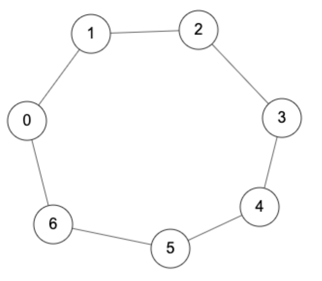
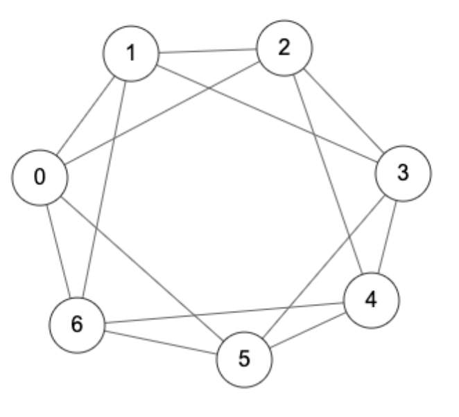
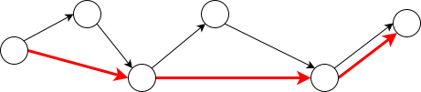
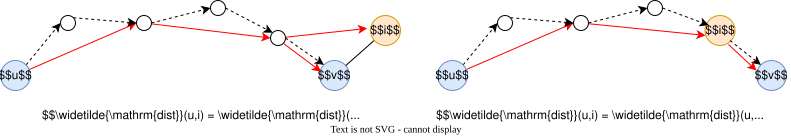
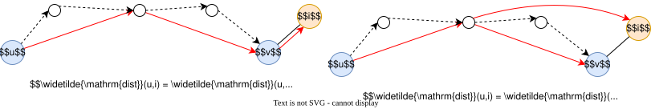

# Seidel法

---
layout: top-title
color: amber-light
---

::title::
# 高速な全点間最短経路問題

::content::

- 全点間最短経路問題は **$O(n^3)$ 時間** で解ける
- $n^2$ 個の数字を出力するので, 必ず$n^2$時間はかかる

<v-clicks>

$O(n^2)$ 時間で解けないか?

- 行列積では, 自明なアルゴリズムは$O(n^3)$時間だが, 工夫すると $O(n^{2.374})$ 時間で解ける
  - 同じようにしてこの問題も$O(n^{2.374})$時間で解けないの?
- 非常に有名な問題なので, 多くの研究がある

</v-clicks>

---
layout: top-title
color: amber-light
---

::title::
# 全点間最短経路問題の歴史

::content::

| year | $\omega$ |  authors |
|:--:|:--|:--|
| 1962 | $n^3$ | [Warshall](https://dl.acm.org/doi/10.1145/321105.321107), [Floyd](https://dl.acm.org/doi/10.1145/367766.368168) |
| 1976 | $n^3\cdot \frac{(\log\log n)^{1/3}}{(\log n)^{1/3}}$ | [Fredman](https://epubs.siam.org/doi/10.1137/0205006) |
| 1990 | $n^3\cdot \sqrt{\frac{\log\log n}{\log n}}$ | [Dobosiewicz](https://www.tandfonline.com/doi/abs/10.1080/00207169008803814) |
| 1991 | $\frac{n^3}{(\log n)^{1/2}}$ | [Takaoka](https://www.sciencedirect.com/science/article/pii/002001909290200F) |

|year | $\omega$ | authors |
|:--:|:--|:--|
| 2004 | $n^3\cdot (\frac{\log\log n}{\log n})^{5/7}$ | [Han](https://www.sciencedirect.com/science/article/pii/S0020019004001528) |
| 2004 | $n^3\cdot \frac{(\log\log n)^2}{\log n}$ | [Takaoka](https://link.springer.com/chapter/10.1007/978-3-540-27798-9_31) |
| 2004 | $n^3\cdot \frac{\sqrt{\log\log n}}{\log n}$ | [Zwick](https://link.springer.com/chapter/10.1007/978-3-540-30551-4_78) |
| 2005 | $\frac{n^3}{\log n}$ | [Chan](https://link.springer.com/chapter/10.1007/11534273_28) |

|year | $\omega$ | authors |
|:--:|:--|:--|
| 2006 | $n^3\cdot ( \frac{\log\log n}{\log n} )^{5/4}$ | [Han](https://link.springer.com/chapter/10.1007/11841036_38) |
| 2007 | $n^3\cdot \frac{(\log\log n)^3}{(\log n)^2}$ | [Chan](https://epubs.siam.org/doi/10.1137/08071990X) |
| 2012 | $n^3\cdot \frac{\log\log n}{(\log n)^2}$ | [Han and Takaoka](https://link.springer.com/chapter/10.1007/978-3-642-31155-0_12) |
| 2014 | $n^3\cdot 2^{-\sqrt{\log n}}$ | [Williams](https://epubs.siam.org/doi/10.1137/15M1024524) |

<v-clicks>

- 現在最速のアルゴリズムはWilliams(2014)で, **$n^3/2^{\sqrt{\log n}}$** 時間 
  - これは $n^{2.999}$ よりは大きいが, $n^3/(\log n)^{1000}$ よりは小さい

全点対最短経路問題は, 任意の定数$\varepsilon>0$に対して$O(n^{3-\varepsilon})$時間で**解けない**と予想されている (APSP予想)

</v-clicks>

---
layout: top-title
color: amber-light
---

::title::
# Seidel法

::content::

 辺重みなし (全ての辺重みが$1$) の場合はより高速に解けるだろうか?

<v-clicks>

- 幅優先探索という手法を用いると, 最悪の場合は $O(n^3)$ 時間
- **Seidel法**という高速なアルゴリズムが知られている [(Seidel, 1995)](https://www.sciencedirect.com/science/article/pii/S0022000085710781?via%3Dihub).

二つの$n\times n$の行列積が $O(n^\omega)$時間で計算できるならば,,
$n$頂点の重みなしグラフに対する全点間最短経路問題は **$O(n^\omega \log n)$ 時間**で解ける.

- $\omega < 2.373$ であることが知られている (cf. 第三回講義資料)
- 行列積が高速に計算できる $\Rightarrow$ 最短経路も高速に計算できる
- 簡単のため, グラフは連結であるとする

</v-clicks>

---
layout: top-title
color: amber-light
---

::title::
# Seidel法

::content::

アイデア: **長さ$2$以下の路**でつながれた頂点間に辺を貼ったグラフ (**2-ホップグラフ**) を考えて**再帰**する

  

    
    
元のグラフ

  

  
&#8594;

  

    
    
 2-ホップグラフ 

  

---
layout: top-title
color: amber-light
---

::title::
# Seidel法

::content::

アイデア: **長さ$2$以下の路**でつながれた頂点間に辺を貼ったグラフ (**2-ホップグラフ**) を考えて**再帰**する

<v-clicks>

- 2-ホップグラフ上では, **ショートカット**ができるので, 距離はおよそ半分になる

  

- 連結グラフ上では任意の頂点間の距離は$\le n$
  - 2-ホップグラフだと $\le \lceil n/2 \rceil$ -> およそ半分

再帰の深さは $O(\log n)$ 回で抑えられる

</v-clicks>

---
layout: top-title
color: amber-light
---

::title::
# 2-ホップグラフ

::content::

- $2$-ホップグラフ$\widetilde{G}$はどうやって計算するのか? -> **路と隣接行列の関係**を思い出そう!

<v-clicks>

隣接行列 $A$ と任意の二頂点 $u,v\in V$ に対し, $A^2_{u,v}$ は $u$ から $v$ への**長さ$2$の路**の本数に等しい.

- 特に, $\widetilde{G}$の隣接行列は以下となる:
  
  $$
    \begin{align*}
      \widetilde{A}_{u,v} = \begin{cases}
        1 & \text{if }A^2_{u,v}>0 \text{ and }u\ne v,\\
        0 & \text{otherwise}.
      \end{cases}
    \end{align*}
  $$
  
- これは$A^2$を計算すれば求められるので, 行列積により **$O(n^\omega)$時間** で計算可能
  
</v-clicks>

---
layout: top-title
color: amber-light
---

::title::
# 距離行列の計算

::content::

$2$-ホップグラフ $\widetilde{G}$ の距離 $\widetilde{\dist}(u,v)$ から, 元のグラフの距離 $\dist(u,v)$ をどのように計算すればよいか?

<v-clicks>

- $2$-ホップグラフ上では, **ショートカット**ができるので, $\widetilde{\dist}(u,v) = \lceil \dist(u,v)/2 \rceil$ となる
- 従って, $\dist(u,v)$ は **$2\widetilde{\dist}(u,v)$** または **$2\widetilde{\dist}(u,v)-1$** のどちらか
  - 下図では, $\dist(u,v)=5$, $\widetilde{\dist}(u,v)=3$

  

$\dist(u,v)$ の**偶奇**が判明すれば, $\dist(u,v)$が計算できる -> どうやって偶奇を計算するの?

</v-clicks>

---
layout: top-title
color: amber-light
---

::title::
# 距離の偶奇の計算

::content::

方針: $v$の**隣接頂点 $i$** に対し, $\widetilde{\dist}(u,\textcolor{c2185b}{v})$ と $\widetilde{\dist}(u,\textcolor{c2185b}{i})$ を比較する.

- ケース1. $\dist(u,v)$ が奇数のとき:
  - $\widetilde{G}$上での$uv$最短路において, 最後の辺以外がショートカットになるものが存在

<v-click>

  

  - 点線 = 元のグラフ$G$上の最短経路
  - 赤線 = $\widetilde{G}$上の最短経路

</v-click>

---
layout: top-title
color: amber-light
---

::title::
# 距離の偶奇の計算

::content::

方針: $v$の**隣接頂点 $i$** に対し, $\widetilde{\dist}(u,\textcolor{c2185b}{v})$ と $\widetilde{\dist}(u,\textcolor{c2185b}{i})$ を比較する.

- ケース1. $\dist(u,v)$ が奇数のとき:
  - $\widetilde{G}$上での$uv$最短路において, 最後の辺以外がショートカットになるものが存在

  

- 全ての $i$ に対して $\widetilde{\dist}(u,i) \le \widetilde{\dist}(u,v)$
  - 特に, $i$が$G$上の最短経路上にあるときは $\widetilde{\dist}(u,i) = \widetilde{\dist}(u,v)-1$

---
layout: top-title
color: amber-light
---

::title::
# 距離の偶奇の計算

::content::

方針: $v$の**隣接頂点 $i$** に対し, $\widetilde{\dist}(u,\textcolor{c2185b}{v})$ と $\widetilde{\dist}(u,\textcolor{c2185b}{i})$ を比較する.

- ケース1. $\dist(u,v)$ が奇数のとき:
  - $\widetilde{G}$上での$uv$最短路において, 最後の辺以外がショートカットになるものが存在

  

$$
  \begin{align*}
    \sum_{i\in\text{$v$}の隣接頂点集合} \widetilde{\dist}(u,\textcolor{c2185b}{i}) < \sum_{i\in\text{$v$}の隣接頂点集合} \widetilde{\dist}(u,\textcolor{c2185b}{v})
  \end{align*}
$$

---
layout: top-title
color: amber-light
---

::title::
# 距離の偶奇の計算

::content::

方針: $v$の**隣接頂点 $i$** に対し, $\widetilde{\dist}(u,\textcolor{c2185b}{v})$ と $\widetilde{\dist}(u,\textcolor{c2185b}{i})$ を比較する.

- ケース2. $\dist(u,v)$ が偶数のとき, 
  - $\widetilde{G}$上での**全ての$uv$最短路はショートカットからなる**

<v-click>

  

- $v$の全ての隣接頂点 $i$ に対して $\widetilde{\dist}(u,i) \ge \widetilde{\dist}(u,v)$ が成り立つ (証明は演習)

</v-click>

---
layout: top-title
color: amber-light
---

::title::
# 距離の偶奇の計算

::content::

方針: $v$の**隣接頂点 $i$** に対し, $\widetilde{\dist}(u,\textcolor{c2185b}{v})$ と $\widetilde{\dist}(u,\textcolor{c2185b}{i})$ を比較する.

- ケース2. $\dist(u,v)$ が偶数のとき, 
  - $\widetilde{G}$上での**全ての$uv$最短路はショートカットからなる**

  

$$
  \begin{align*}
    \sum_{i\in\text{$v$}の隣接頂点集合} \widetilde{\dist}(u,\textcolor{c2185b}{i}) \ge \sum_{i\in\text{$v$}の隣接頂点集合} \widetilde{\dist}(u,\textcolor{c2185b}{v})
  \end{align*}
$$

---
layout: top-title
color: amber-light
---

::title::
# 距離の偶奇の計算

::content::

- 以上より, 距離の偶奇性に関して以下が成り立つ:

$$
  \begin{align*}
    \dist(u,v)\text{が偶数}\iff \sum_{i\in\text{$v$}の隣接頂点集合} \widetilde{\dist}(u,\textcolor{c2185b}{i}) \ge \sum_{i\in\text{$v$}の隣接頂点集合} \widetilde{\dist}(u,\textcolor{c2185b}{v})
  \end{align*}
$$

<v-clicks>

- 不等号の右辺は, $\deg(v)\cdot \widetilde{\dist}(u,v)$ に等しい ($\Sigma$の中身が$i$に依存しないから)
- 左辺について: $\textcolor{c2185b}{\widetilde{\dist}}\in \Real^{V\times V}$ を, $\widetilde{\dist}(u,v)$を並べて得られる行列とすると

$$
  \begin{align*}
    \sum_{i\in\text{$v$}の隣接頂点集合} \widetilde{\dist}(u,i) = \sum_{i\in V} \widetilde{\dist}(u,i)\cdot \textcolor{c2185b}{A_{i,v}} = (\textcolor{c2185b}{\widetilde{\dist}\cdot A})_{u,v}
  \end{align*}
$$

 $i$が$v$と隣接している $\iff$ $A_{i,v}=1$

</v-clicks>

---
layout: top-title
color: amber-light
---

::title::
# 距離の偶奇の計算

::content::

全ての$u,v\in V$に対して, $\dist(u,v)\bmod 2$ を計算せよ.

- 以下のアルゴリズムで解ける ($\widetilde{\dist}$は得られているとする)

1. 隣接行列 $A$ に対して, 行列積アルゴリズムを使って $\widetilde{\dist}\cdot A$ を計算する
2. 各$u,v\in V$ に対して
   1. $(\widetilde{\dist}\cdot A)_{u,v} \ge \deg(v)\cdot \widetilde{\dist}(u,v)$ならば, $\dist(u,v)$は偶数
   2. そうでなければ, $\dist(u,v)$は奇数

<v-click>

- 行列積が $O(n^\omega)$ 時間で計算できるので, このアルゴリズムも $O(n^\omega)$ 時間

</v-click>

---
layout: top-title
color: amber-light
---

::title::
# Seidel法

::content::

- $\dist(u,v)$ と $\widetilde{\dist}(u,v)$ の関係:
  
  $$
    \begin{align*}
      \dist(u,v) = \begin{cases}
        2\widetilde{\dist}(u,v) - 1 & \text{if }\dist(u,v)\text{が奇数},\\
        2\widetilde{\dist}(u,v) & \text{otherwise}. 
      \end{cases}\tag{a}
    \end{align*}
  $$

  を使って, $\dist(u,v)$ が計算できる!

<v-clicks>

1. 2-ホップグラフ $\widetilde{G}$ を計算して, 再帰的に$\widetilde{\dist}$ を求める
2. 全ての$u,v\in V$ に対して $\dist(u,v) \bmod 2$ を計算する
3. (a)を使って$\dist(u,v)$を計算する

- 全体の計算量は $O(n^\omega \log n)$
  - 再帰の深さは $O(\log n)$ で, $\dist(u,v)$の偶奇の計算は $O(n^\omega)$時間で可能

</v-clicks>

---
layout: top-title
color: amber-light
---

::title::
# Seidel方のまとめ

::content::

- 一般に重みつきグラフの全点対最短経路は$n^3$時間を抜本的に改善することは難しいと予想されている
  - 2025年現在知られている理論上最速のアルゴリズムは $O(n^3/2^{-\sqrt{\log n}})$ 時間

- Seidel法を使うと, 辺重みがない場合は**行列積を使って**高速に解ける
  - 実用上はスーパーコンピュータ(GPGPU)を使うと行列積は高速計算できる
- アルゴリズムの概要
  - **2-ホップグラフ $\widetilde{G}$** を構成して再帰
  - 偶奇の計算だけ (証明が) 複雑