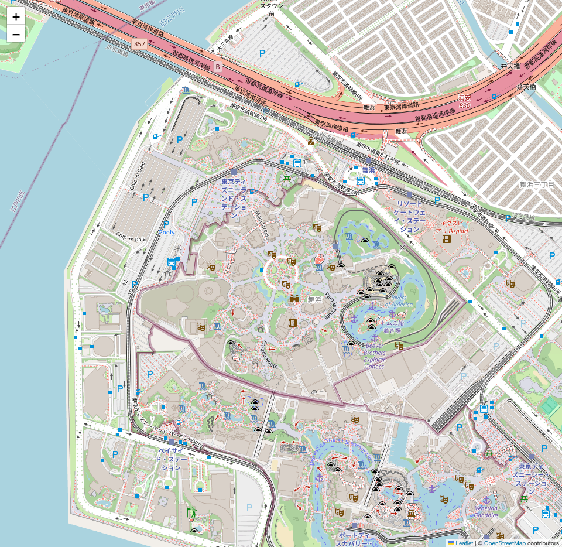
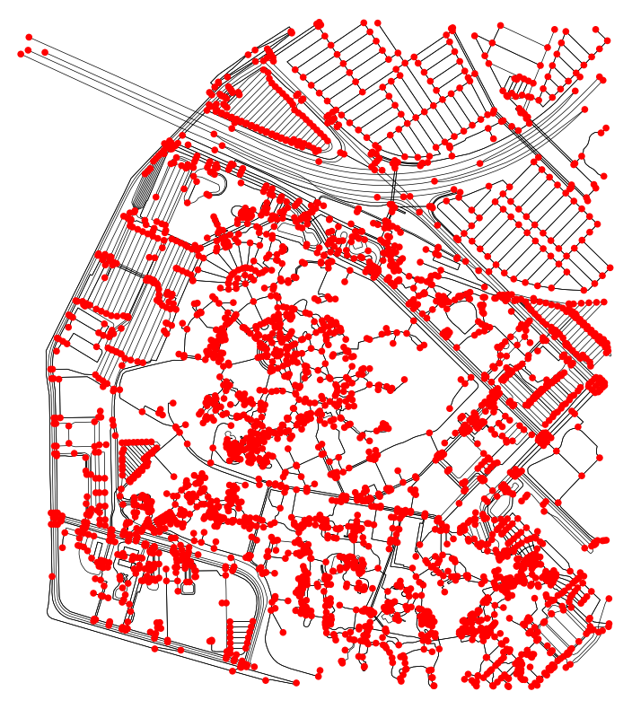
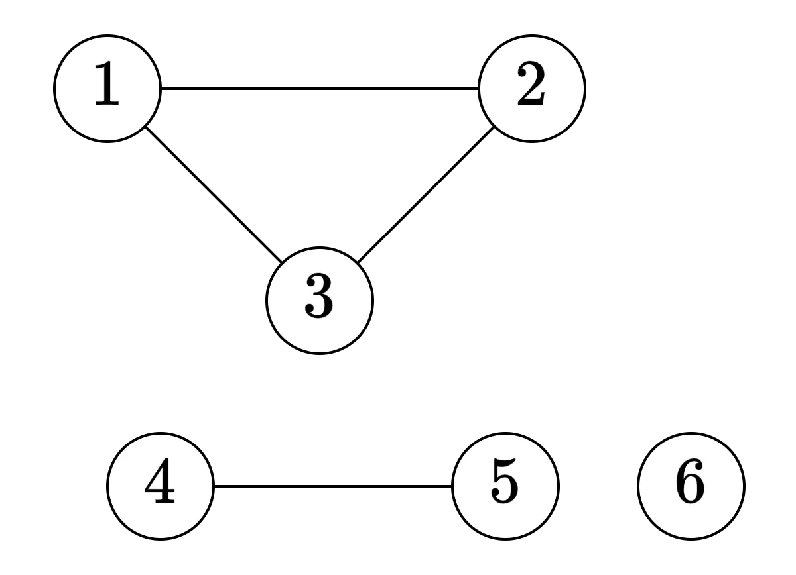
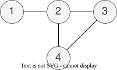
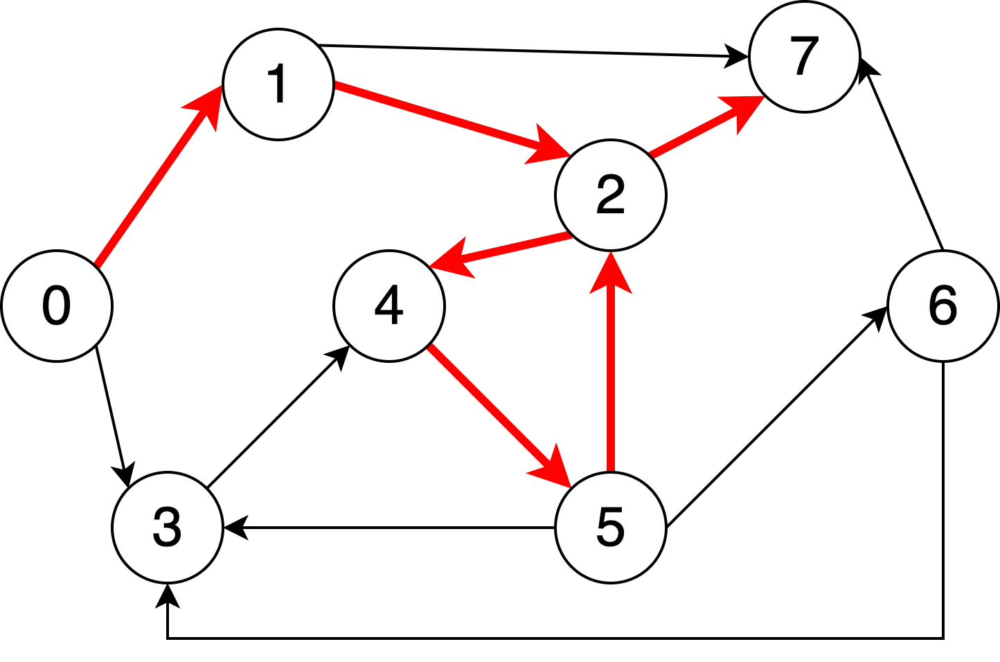
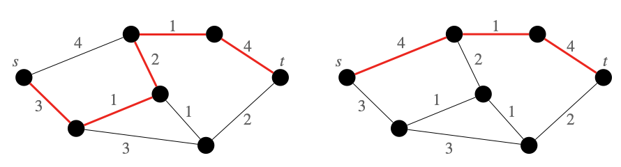

# プログラミング応用 第4回: <br> グラフアルゴリズム

[清水 伸高](https://sites.google.com/view/nobutaka-shimizu/home) (塩浦研 助教)

<div style="position: absolute; bottom: 20px; font-size: 0.8em; width: 100%; text-align: center;">
2025年 10月28日
</div>

---
layout: top-title
color: amber-light
---

::title::
# 内容: ネットワーク + 数学 + アルゴリズム

::content::

1. [ネットワークの数学](/3)
   - [グラフの定義](/5)
2. [最短経路問題](19)
3. [応用: ネットワークの中心性](/23)
4. [Floyd--Warshall法](/30)
5. [Seidel法](/40)

---
layout: section
color: amber-light
---

# ネットワークの数学

---
layout: top-title
color: amber-light
---

::title::

# グラフ

::content::

- ネットワーク: モノとモノの**繋がり**を表す抽象的な構造
  - 路線図, SNSの繋がり, 化合物など

- **グラフ**とは, ネットワークを表現する数学的な概念
  - 「点と点が線で繋がっている」という性質のみを抽出

<div class="image-container" style="width: 60%; margin: auto; display: flex; justify-content: center; gap: 20px;">
  
  
</div>


---
layout: top-title
color: amber-light
---

::title::

# グラフ

::content::


<div class="definition">

- 集合 $V$ に対し, $\binom{V}{2}=\cbra{ \cbra{u,v} \subseteq V\colon u\ne v }$ とする.
- 有限集合$V$と集合$E\subseteq \binom{V}{2}$に対し, $(V,E)$を**グラフ**という

</div>

- 例: $V=\{1,2,3\}$ のとき: $\binom{V}{2}=\cbra{ \{1,2\}, \{1,3\}, \{2,3\} }$
- 例: $V=\cbra{1,2,3}$, $E=\cbra{\cbra{1,2},\cbra{1,3}}$

<div class="image-container" style="width: 30%; margin: 24px auto;">
  
</div>

<div class="topic-box" v-click>

重要なポイント: グラフを **数学的に** 表現している

</div>

---
layout: top-title
color: amber-light
---

::title::
# グラフの例

::content::

<div class="image-container" style="width: 40%; margin: 24px auto;">
  
  <div style="text-align: center; font-size: 0.95em; margin-top: 8px;" markdown="1">
    これも「一つの」グラフ
  </div>
</div>


$$
  \begin{align*}
    &V = \set{1,2,3,4,5,6},\\
    &E = \set{\{1,2\}, \{2,3\}, \{1,3\}, \{4,5\} }.
  \end{align*}
$$


---
layout: top-title-two-cols
color: amber-light
ratio: 7:3
---

::title::

グラフの用語

::left::

- 集合$V$を**頂点集合**と呼び, その要素$u\in V$を **頂点 (vertex)** という
- 集合$E$を**辺集合**と呼び, その要素$e\in E$を **辺 (edge)** という

<v-clicks>

- グラフは二頂点間の**双方向な関係の有無**のみを表現している
  - $\{u,v\}=\{v,u\}$ (集合として一致するので同一の辺とみなす)

- 場合によっては
  - 二頂点間の距離
  - 一方向性の関係

  を表現したいこともある -> **重みつきグラフ**, **有向グラフ**

</v-clicks>

::right::


---
layout: top-title
color: amber-light
---

::title::

# 重みつきグラフ

::content::

<div class="definition">

グラフ$G=(V,E)$と関数$w\colon E\to \Real$をまとめたもの$(V,E,w)$を**重みつきグラフ**といい,
辺$e\in E$に対し$w(e)$を$e$の**重み**という.

</div>

<div style="display: grid; grid-template-columns: 7fr 3fr; align-items: start; gap: 1.5em;">
  <div>
    <div markdown="1">

<v-clicks>

- 多くの実用的な場面では, $w(e)\ge 0$
  - 理論的な場面では $w(e)<0$ も考えることがある
- 非負であることを強調したい場合, **非負重み** と呼ぶこともある  
- グラフ $G=(V,E)$ が重みを持たないことを強調したい場合, $G$ を **重みなしグラフ** と呼ぶこともある  

</v-clicks>

</div>
  </div>
  <div>
    
  </div>
</div>

---
layout: top-title
color: amber-light
---

::title::

# 有向グラフ

::content::

<div class="definition">

- 集合 $V$ に対し, $V\times V=\{(u,v)\colon u\in V,v\in V\}$ ($V$の**直積**)
- 有限集合$V$と集合$E\subseteq V\times V$に対し, $(V,E)$を**有向グラフ**という

</div>

<div style="display: grid; grid-template-columns: 7fr 3fr; align-items: start; gap: 1.5em;">
  <div>
    <div markdown="1">

<v-clicks>

  - グラフを有向グラフと区別するために**無向グラフ**と呼ぶこともある
  - 有向グラフでは $(u,v)\ne (v,u)$ ($u$と$v$の順序を区別)
  - 無向グラフを有向グラフとして表現できる
    - 無向辺 $\{u,v\}\in E$ に対し, 二つの有向辺 $(u,v)$ と $(v,u)$ を考える
  - この講義では自己ループ $(u,u)\in V\times V$ は考えない

</v-clicks>

</div>
  </div>
  <div>
    
  </div>
</div>


---
layout: top-title
color: amber-light
---

::title::
# 基本的な用語(1/2)

::content::

<div style="display: grid; grid-template-columns: 7fr 3fr; align-items: start; gap: 1.5em;">
  <div>
    <div markdown="1">

  無向グラフ $G=(V,E)$ を考える.
  - **$\{u,v\}\in E$** のとき, $u$と$v$は**隣接している**という
  - 頂点$u$と辺$e$が **$u\in e$** を満たすとき, $u$は$e$に**接している**という
  - 頂点$u$に接している辺の本数を$u$の**次数**と呼び, **$\deg(u)$** で表す
  
  <div style="height: 1.2em;"></div>

  <v-click>

  有向グラフ $G=(V,E)$ を考える.
  - 頂点 $u$ から出ている辺の本数を $u$ の**出次数**と呼び, **$\deg^+(u)$** で表す
  - 頂点 $u$ に入っている辺の本数を $u$ の**入次数**と呼び, **$\deg^-(u)$** で表す

  </v-click>

</div>
  </div>
  <div>
    
  </div>
</div>

---
layout: top-title
color: amber-light
---

::title::
# グラフの表現1. 隣接行列

::content::

<div class="definition">

無向グラフ $G=(V,E)$ に対し, 以下で定まる行列$A\in\{0,1\}^{V\times V}$ を **隣接行列** という:

$$
  \begin{align*}
    A_{u,v} = \begin{cases}
      1 & \text{if }\{u,v\}\in E,\\
      0 & \text{otherwise}.
    \end{cases}
  \end{align*}
$$

</div>

<div style="display: grid; grid-template-columns: 7fr 3fr; gap: 2em; align-items: center;" v-click>
  <div>
  右の図で表されるグラフの隣接行列は以下のようになる:

  $$\begin{align*}
      A = \begin{pmatrix}
        0 & 1 & 0 & 0 \\
        1 & 0 & 1 & 1 \\
        0 & 1 & 0 & 1 \\
        0 & 1 & 1 & 0 \\
      \end{pmatrix}
    \end{align*}$$
  - 実際の実装では **二次元配列(リスト)** として表現する

  </div>
    <div style="text-align: center;">
      
    </div>
</div>


---
layout: top-title
color: amber-light
---

::title::
# グラフの表現1. 隣接行列

::content::

<div class="definition">

無向グラフ $G=(V,E)$ に対し, 以下で定まる行列$A\in\{0,1\}^{V\times V}$ を **隣接行列** という:

$$
  \begin{align*}
    A_{u,v} = \begin{cases}
      1 & \text{if }\{u,v\}\in E,\\
      0 & \text{otherwise}.
    \end{cases}
  \end{align*}
$$

</div>

- 有向グラフに対しても同様に隣接行列を定義できる
  - $A_{u,v}$を, $(u,v)\in E$ ならば $1$, そうでなければ$0$
- 無向グラフの隣接行列は常に**対称行列**になるが, 有向グラフでは常にそうなるとは限らない

---
layout: top-title
color: amber-light
---

::title::
# グラフの表現2. 隣接リスト

::content::

<div class="definition">

グラフ $G=(V,E)$ を考える. 頂点 $u\in V$ に対し, $u$に隣接している頂点の集合を $N_u\subseteq V$ とする.
全ての頂点 $u\in V$ に対して $N_u$ を集めた集合族 $(N_u)_{u\in V}$ を **隣接リスト** という. 

</div>

<div style="display: grid; grid-template-columns: 7fr 3fr; gap: 2em; align-items: center;" v-click>

  <div>  
    右の図で表されるグラフの隣接リストは以下のようになる:


  $$\begin{align*}
      &N_1 = \{2\},& & N_2 = \{1,3,4\},\\
      &N_3 = \{2,4\},& & N_4 = \{2,3\}.
    \end{align*}$$

  実装では配列もしくはリストを使う:
  
  ```python
  adjlist = [
      [2],      # 頂点1に隣接する頂点
      [1, 3, 4],# 頂点2に隣接する頂点
      [2, 4],   # 頂点3に隣接する頂点
      [2, 3]    # 頂点4に隣接する頂点
  ]
  ```

  </div>
  <div style="text-align: center;">
    
  </div>
</div>

<v-click>

- 講義用に, 隣接行列と隣接リストを生成する [ページ](https://nobutakashimizu.github.io/graph_generate/) を作成しました.

</v-click>

---
layout: top-title
color: amber-light
---

::title::
# 隣接リストと隣接行列の比較

::content::

- 隣接行列: 二頂点 $u,v$ が繋がってるかがすぐにわかる (**時間効率**がよい)
  - $O(1)$時間で判定可能 (ランダムアクセスを仮定)
  - 隣接リストでは, $N_u$ が $v$ を含むかどうかを判定しなければならない
- 一方, 隣接リストは隣接行列より少ないビット数でグラフを表現できる (**空間効率**がよい)
  - グラフ $G=(V,E)$ を $O(|E|\log |V|)$ ビットで表現
  - 一つの頂点 $u\in V$ を指定するのに $\lceil \log_2 |V| \rceil$ ビット必要
  - 隣接行列は $|V|^2$ ビット必要

<div class="topic-box" v-click>

  - グラフの辺の本数が少ない場合 ($|E|\ll |V|^2$) は隣接リスト
  - 辺の本数が多い場合やメモリに余裕がある場合は隣接行列

</div>

---
layout: top-title
color: amber-light
---

::title::
# 路

::content::

<div class="definition">

有向グラフ $G=(V,E)$ に対して, 頂点列 $(v_0,v_1,v_2,\dots,v_{\ell-1},v_\ell)$ であって, 全ての $(v_i,v_{i+1})$ が辺になっているものを $v_0$ から $v_{\ell}$ への**路**という. 特に, 路の先頭の頂点 $v_0$ を**始点**, 末尾の頂点 $v_\ell$ を**終点**と呼ぶ. また, このときの $\ell$ を路の**長さ**とよぶ.

</div>

<div style="display: grid; grid-template-columns: 7fr 3fr; gap: 2em; align-items: center;">

  <div>  

  - 始点$s$, 終点$t$を持つ路を **$st$-路** と呼ぶこともある.
  - 路に含まれる頂点 $v_0,\dots,v_\ell$ は**重複しうる**.
  - 重み付きグラフでは途中で経由する**辺の重みの総和**を長さと定める
  
  <div class="remark" v-click>
  
  グラフ理論の教科書では路を「道(path)」「歩(walk)」などと呼ぶこともある.
  紛らわしくなるので講義では原則として「路」のみを扱う.
  
  </div>

  </div>
  <div style="text-align: center;">
    
    <div style="font-size: 0.95em; margin-top: 0.5em; color: #666;"> 路 (0,1,2,4,5,2,7) </div>
  </div>
</div>

---
layout: top-title
color: amber-light
---

::title::
# 閉路

::content::

<div class="definition">

有向グラフの路 $(v_0,\dots,v_\ell)$ であって, $v_0 = v_\ell$ を満たすものを **閉路** という.
閉路であって, 始点と終点以外の頂点が重複しないものを **単純閉路** という.

</div>

- 始点と終点が同じである路
- 一頂点からなる $(u)$ も閉路とみなす (長さ$0$)
- 重み付きグラフを考える場合は, 閉路が通過する**辺の重みの総和**をその閉路の重みと定義


---
layout: top-title
color: amber-light
---

::title::
# 路と隣接行列の関係

::content::

- 無向グラフ $G=(V,E)$ の隣接行列を $A \in \binset^{V\times V}$ とする
- 頂点 $u,v\in V$ を固定し, $A^2_{u,v}$ を考えてみよう:
  
  $$
    \begin{align*}
      A^2_{u,v} = \sum_{x\in V} A_{u,x} A_{x,v} \tag{1}
    \end{align*}
  $$
  
  <v-click> 
  
  総和の中身は, **$\set{u,x}$ と $\set{x,v}$ が辺をなす**ときに $1$ となる (それ以外は $0$)
  
  </v-click>
  
<v-clicks>

- 従って, $A_{u,x}\cdot A_{x,v}=1$ $\iff$ $(u,x,v)$ が $G$ の路である

<div class="topic-box">

  $(1)$ 式は **$u$ から $v$ への長さ $2$ の路の本数** を表している

</div>

</v-clicks>

---
layout: top-title
color: amber-light
---

::title::
# 路と隣接行列の関係 (cont'd)

::content::

<div class="theorem">

任意の $\ell\ge 0$ に対して $A^\ell_{u,v}$ は **$u$ から $v$ への長さ $\ell$ の路の本数** を表している.

</div>

<v-clicks>

- 証明は演習 (ヒント: 帰納法)
- $\ell=0$ のとき, $A^0=I$ (単位行列) とする
- 特に $u=v$ のとき, $A^\ell_{u,u}$ は **頂点 $u$ を通過する長さ $\ell$ の閉路の本数** を表している

<div class="remark">

- 時計回りと反時計回りの閉路は別々に数えられる (例えば$(a,b,c,d)$ と $(a,d,c,b)$ は別の閉路)
- 途中で同じ頂点を2回以上通過する閉路も数えられている (つまり, 単純閉路以外も数えられている)

</div>

</v-clicks>

---
layout: section
color: amber-light
---

# 最短経路問題


---
layout: top-title
color: amber-light
---

::title::
# 最短経路問題とは?

::content::

<div class="question">

重み付きグラフ $G=(V,E,w)$ および二頂点 $s,t\in V$ が与えられる.
$st$-路のうち, 長さが最小となるものの距離 $\dist(s,t)$ を求めよ.

</div>

<v-clicks>

- 最短経路の長さを**距離**と呼ぶ

<div class="image-container" style="width: 100%; margin: auto; display: flex; justify-content: center;">
  
</div>

- この図では無向グラフを考えているが, 一般に有向グラフを考える
- $st$-路があると仮定 (ない場合は距離$=\infty$)

</v-clicks>

---
layout: top-title
color: amber-light
---

::title::
# 単一始点と全点対

::content::

- 最短経路問題には二つの種類がある

  - **単一始点**最短経路問題: 始点$s$から他の全ての頂点への距離 $(\dist(s,u))_{u\in V}$ を求める問題

  - **全点対**最短経路問題: 全ての始点と終点の間の距離 $(\dist(s,t))_{s,t\in V}$ を求める問題

<v-clicks>

<div class="remark">

グラフに負重みを許す場合, 長さ負の閉路があると, その閉路を巡回するだけで距離をいくらでも減らせる.

<div style="display: flex; justify-content: center; align-items: center;">
  
</div>

上の図の場合, $\dist(A,C)=-\infty$ と定める.

</div>

</v-clicks>

---
layout: top-title
color: amber-light
---

::title::
# 有名アルゴリズム一覧

::content::

<div style="display: flex; gap: 1em; font-size: 0.8em; border: 1px solid #ccc; padding: 0.8em; border-radius: 5px;">
<div style="flex: 1; min-width: 0;">

| アルゴリズム名 | 計算量 | 特徴 |
|:--:|:--|:--|
| Dijkstra法 | $O(\abs{E}\log\abs{V})$ | 辺重みが**非負の場合のみ**有効. 優先度付きキューを利用して実装. |
| Bellman--Ford法 | $O(\abs{V}\abs{E})$ | 負の重みがあっても利用可能. 負閉路の検出もできる. |
| Floyd--Warshall法 | $O(\abs{V}^3)$ | 動的計画法で全点対最短経路を直接計算. 隣接行列ベースで実装が簡単. |

</div>
</div>

<style>
th {
  background-color: #e3f2fd;
  color: #1976d2;
  font-weight: bold;
}
</style>

<v-clicks>

- ダイクストラ法は代表的なアルゴリズムだが, 別の講義で扱う予定なので, ここでは紹介のみ
- この講義では, **Floyd--Warshall法**をやります

<div class="remark">

Floyd(1962)とWarshall(1962)が独立に考案したアルゴリズムだが, 論文の出版月はWarshallの方が早い.
ちなみになぜか日本ではWarshall--Floyd法と呼び, 海外ではFloyd--Warshall法と呼ぶことが多い
(多分, 海外ではアルファベット順がメジャー?)

</div>

</v-clicks>

---
src: centrality.md
hide: false
---

---
src: floyd_warshall.md
hide: false
---

---
src: seidel.md
hide: false
---


---
layout: top-title
color: amber-light
---

::title::
# 今日のまとめ

::content::

- グラフの定義
- 最短経路問題
  - 単一始点最短経路問題
  - 全点対最短経路問題
- ネットワーク解析
  - 媒介中心性
  - 近接中心性
- Floyd--Warshall法
- Seidel法