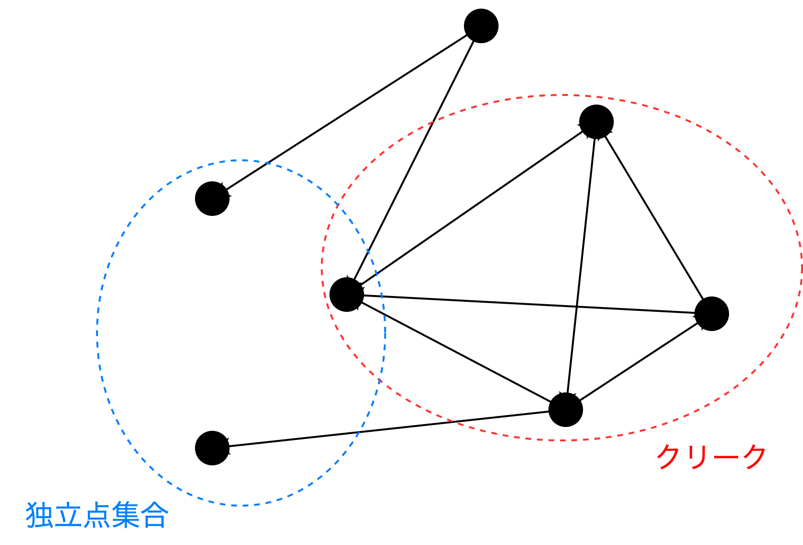
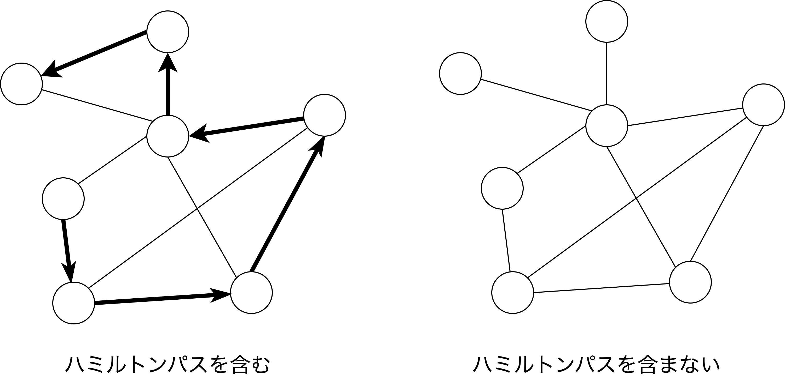
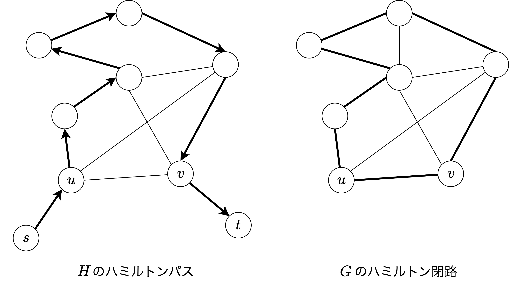

# プログラミング応用 第5回: <br> 計算量理論

[清水 伸高](https://sites.google.com/view/nobutaka-shimizu/home) (塩浦研 助教)

<div style="position: absolute; bottom: 20px; font-size: 0.8em; width: 100%; text-align: center;">
2025年 11月7日
</div>

---
layout: top-title
color: amber-light
---

::title::
# 内容: 計算量理論

::content::

1. [アルゴリズムと入力長の定義](/5)
2. [問題の定義](/16)
3. [帰着](/33)
4. [NP完全とNP困難](/46)


---
layout: top-title
color: amber-light
---

::title::
# 解きやすい問題と解きにくい問題

::content::

- 世の中には, 効率的に解ける問題はたくさんある
  - 講義で扱った問題: 4SUM問題, 最短経路問題, 多項式同一性判定問題, etc 

<div class="topic-box">

一方で, **効率的に解けて欲しくない**問題も存在する:

- 素因数分解 -> RSA暗号の安全性保証の根拠
- ハッシュ関数(SHA-256)の衝突探索 -> ブロックチェーン(Bitcoin)の安全性保証の根拠
- Learning Parity with Noise (LPN) 問題 -> 耐量子暗号の安全性保証の根拠

</div>

<div class="remark">

- これらの問題は**効率的には解けない**と多くの研究者が信じているが, 証明はされていない
- 実用的に高速に解けたら世界がヤバイ

</div>

---
layout: top-title
color: amber-light
---

::title::
# 計算量理論とは?

::content::

<div class="topic-box">

計算量理論とは, 計算問題を解くために必要なリソース(時間, 空間, 通信量, etc) を解明する理論.

</div>

- **アルゴリズムの限界**: 行列積は理論上どこまで高速化できるのか?
- **実用的なアルゴリズムの解析**: 線形計画問題の単体法はなぜ実用的に高速なのか?
- **擬似ランダムネス**: 乱択アルゴリズムのランダムネスは本質的に必要なのか?
- **暗号学的プリミティブ**: ゼロ知識証明や鍵交換アルゴリズムは本当に安全なのか?
- **量子情報**: 量子アルゴリズムは古典アルゴリズムに対して優位性をもつのか?
- **均衡点の計算**: 市場均衡やナッシュ均衡は効率的に計算できるのか?
- **学習理論**: 学習に必要なサンプル数はどれくらい必要なの?
- **誤り訂正符号**: QRコードはどうしてノイズがあっても復元できるのか?

---
layout: section
color: amber-light
id: what-is-complexity-theory
---

# アルゴリズムと入力長の定義


---
layout: top-title
color: amber-light
---

::title::
# アルゴリズムの定義

::content::

<div class="definition">

- Pythonの基礎的な命令で記述される関数を **アルゴリズム** と呼ぶ.
- $\Sigma=\{$ `a`, ..., `z`, `0`, ..., `9`, `(`, `)`, `,`, ... $\}$を**キーボードで打てる一文字**の集合とする.
- $n\ge 0$に対し $\Sigma^n$ を長さ$n$の文字列集合 ($n=0$も含む)
- $\Sigma^* = \bigcup_{n\ge 0} \Sigma^n$ を有限長の文字列全体の集合とする
- $x\in\Sigma^*$ に対し, $\abs{x}$を$x$の文字数とする

</div>

- 以後, これらの記号はかなり頻出します
- ある$c>0$に対し計算量が$O(n^c)$になっているアルゴリズムを**多項式時間アルゴリズム**と呼ぶ.

---
layout: top-title
color: amber-light
---

::title::
# 入力長の議論

::content::

- 行列積問題において以下の行列の積を考えよう：
$$
\left(
\begin{pmatrix}
1.223 & 2131 \\
-3344 & 421
\end{pmatrix},
\begin{pmatrix}
3.5 & 6123 \\
712 & 81
\end{pmatrix}
\right)
$$
 
- 例えばアルゴリズムは以下のような形式で入力を受け取る:
```python
([[1.223,2131],[-3344,421]], [[3.5,6123],[712,81]])
```

- 入力長としては本質的には以下に左右される:
  - 各数字の桁数 (小数点以下も含む)
  - 数字の個数


---
layout: top-title
color: amber-light
---

::title::
# 計算量の再定義

::content::

- あとで理由を述べますが, 以下の定義は便宜上書いただけで, **課題では厳密に扱う必要はありません**.
  
<div class="definition">

計算量の算定において, アルゴリズムは1ステップで以下の操作を行えるとする:

- and, or, not などの**論理演算**
- リストの特定の要素へのアクセス (例: `L[i]` のようなアクセス)
- **1文字**の操作
  - 1桁の数字の操作: 加算, 減算, 乗算, 除算, 比較, 10倍(後に$0$を繋げるだけ)など
  - 値の読み書き (例えば, `x[i]=a` は 変数 `a` に格納されている文字の長さに比例)
  
</div>

---
layout: top-title
color: amber-light
---

::title::
# 例

::content::


- $N$頂点グラフ $G=(V,E)$ が二次元リストで表された隣接行列 `A` として与えられたとする.
  - 入力長は **$n = O(N^2)$** (厳密には `[`, `]`, `,` などの文字数もカウントするがオーダーには影響しない)
  - 頂点数は `N = len(A)` とすると, $O(\log N)$ 時間で得られる
- 辺の本数 $\abs{E}$ を求める以下のコードは計算量 $O(N^2\log N) = O(n\log n)$ 

```python
def degree_zero(A):
  N = len(A)
  e = 0
  for i in range(N):
    for j in range(i):
      e += A[i][j]
  return e
```

- 6行目の加算で `e` の桁数に比例した時間がかかるので, $O(\log N)$ 時間かかる

<div class="topic-box">

計算途中の全ての変数の値の大きさ(桁数)に注意して計算量を見積もる必要がある.

</div>

---
layout: top-title
color: amber-light
---

::title::
# 計算量の算出

::content::

<p align="center">
  
</p>

<div style="text-align: center; font-size: 3em;">
めんどくさい！！！！！ 
</div>

<v-click>

<div style="text-align: center; font-size: 3em;">
でも大事！！！！
</div>
(めんどうだけど...)

</v-click>

---
layout: top-title
color: amber-light
---

::title::
# 計算モデルとChurch--Turingのテーゼ

::content::

<div class="topic-box">

本来は計算量の議論は「何を1ステップと定めるか」を明確に定義しなければならない.
1. 頂点番号のような長さ$O(\log |V|)$の文字列を一度に読み込めるか?
2. 1ステップで可能な数値演算の桁数は?
3. 配列の特定の要素へのアクセスは1ステップで可能か?

</div>

- これらを厳密に定めた計算の枠組みを**計算モデル**と呼ぶ
- 実は, 多項式時間かどうかの議論においては, 概ねどの計算モデルを採用しても結果は変わらない.
  - これを**Church--Turingのテーゼ**という.
  - いつもの計算モデルを「めんどくさい」計算モデルに変換しても計算量は**多項式倍程度しか変わらない**


---
layout: top-title
color: amber-light
---

::title::
# $O(\log n)$-bit word-RAM モデル

::content::

<div class="topic-box">

今回の演習課題では **$O(\log n)$** 桁の数値演算や文字列操作を1ステップで行えるとする (いつも通りの算出でOK) .

</div>

- 辺の本数を数えるさっきのアルゴリズムは $O(n)$ 時間 (入力長は $n=N^2$)

```python
def degree_zero(A):
  N = len(A)
  e = 0
  for i in range(N):
    for j in range(i):
      e += A[i][j]
  return e
```

- 頂点番号や配列のインデックスの指定は大抵の場合 $O(\log n)$ 桁になることが多い
  - **$O(\log n)$-bit Word-RAMモデル**と呼ぶ
- 競技プログラミングやアルゴリズム研究で暗に想定されている計算モデル

---
layout: top-title
color: amber-light
---

::title::
# 計算量の算出が非自明な例: 素数判定

::content::

<div class="question">

十進法で記述された自然数 $m \in \Nat$ が素数ならば$1$, そうでないならば$0$を出力せよ.

</div>

- 試し割りによる以下のアルゴリズムを考えてみよう:

<div class="algorithm">

各 $i=2,3,\dots,m-1$ に対して以下を繰り返す:
  - $m$ を $i$ で割り切れるか調べ, 割り切れたら $0$ を出力して終了

最終的にどの$i$でも割り切れなかったら $1$ を出力して終了
</div>

- このアルゴリズムは最悪の場合, $m-2$回の反復を行う
- アルゴリズムの入力長は $n=\log_{10} m$ なので, 計算量 $\ge m-2 \approx 10^n$ となり多項式時間ではない

---
layout: top-title
color: amber-light
---

::title::
# 桁数を意識しないといけない例

::content::

- フィボナッチ数列の第$m$項 $F_m$ を計算せよ.
  - 入力長は $n = \log_{10} m$
- フィボナッチ数列の一般項の公式を思い出す:

$$
F_m = \frac{1}{\sqrt{5}}\left(\left(\frac{1+\sqrt{5}}{2}\right)^m - \left(\frac{1-\sqrt{5}}{2}\right)^m\right)
$$

- おおよそ $F_m \approx 1.618^m$ くらいなので, 桁数$\propto m$

<div class="topic-box">

$m=10^n$を代入すると, 出力にかかる計算量だけでも入力長 $n$ について指数関数的

</div>

---
layout: top-title
color: amber-light
---

::title::
# まとめ: 計算量の算出

::content::

- 計算量を算出するには, アルゴリズムが1ステップで行える操作を明確に定義する必要がある
- 我々が普段使っている計算モデルは $O(\log n)$-bit word-RAMモデル
  - 頂点番号やインデックスに関する操作は定数時間でできるとする
- ただし, 数値を扱う際は各変数の桁数に注意する必要がある

<div class="topic-box">

常に意識する必要はありませんが, 自分が普段どのような計算モデルで算出しているかを明確に把握することは非常に重要です!!!

</div>

<p align="center">
  
</p>

---
layout: section
color: amber-light
---

# クラスPとクラスNP


---
layout: top-title
color: amber-light
---

::title::
# 判定問題

::content::


- YesまたはNoで答えられる問題を考える.

<div class="definition">

集合 $\Pi\colon \Sigma^* \to \{0,1\}$ を**判定問題**という.

</div>

- 答えがYesならば$\Pi(x)=1$, Noならば$\Pi(x)=0$
- 最適化や探索問題などはYes/Noで答える問題でないので判定問題ではない
- 最も基本的な計算問題の形式  

<div class="definition">

アルゴリズム $A$ が判定問題 $\Pi$ を解く $\iff$ 任意の入力 $x\in\Sigma^*$ に対して $A(x)=\Pi(x)$.

</div>

---
layout: top-title
color: amber-light
---

::title::
# 探索問題

::content::

- 最適化問題や値を計算する問題は, 判定問題ではないく, **探索問題**の特殊ケース

<div class="definition">

集合 $S$ に対して $S\times S=\{(a,b)\colon a,b\in S\}$ を$S$の**直積**といい, 集合 $\Pi\subseteq \Sigma^* \times \Sigma^*$ を**探索問題**という.

</div>

- 探索問題 $\Pi$ は以下を要求している:
  - 入力 $x\in\Sigma^*$ に対して, $(x,y)\in \Pi$ を満たす $y\in\Sigma^*$ を何でも良いので一つ見つけよ
  - ただし, そのような$y$が存在しない場合はそれを検知せよ
- これを行うアルゴリズムは $\Pi$ を**解く**という.
- 解が複数以上存在, もしくは解が存在しない場合もある
  - 最短経路が複数存在する
  - 負閉路を持つグラフの最短経路問題


---
layout: top-title
color: amber-light
---

::title::
# クラスP

::content::

<div class="definition">

ある多項式時間アルゴリズムを用いて解ける**判定**問題の集合を **クラス$\mathsf{P}$** と呼ぶ.

</div>

- 「クラス」は計算量理論の独特の言い回しで, 特定の性質を満たす問題の集合を意味する
- 判定問題じゃない問題は, 多項式時間で解けてもクラス$\mathsf{P}$に属さない
  - 例えば, 最適化問題や探索問題など

- 実は, 多項式時間で解けない判定問題が存在する
  
<div class="theorem">

任意の $c>0$ に対して$O(n^c)$時間で解けない判定問題が存在する (**時間階層定理**).

</div>

---
layout: top-title
color: amber-light
---

::title::
# 「難しい」をどうやって示すか? ---対角線論法---

::content::

- 全ての多項式時間アルゴリズムを列挙し, $A_1,A_2,\dots$ とする (順番は任意)
  - 有限長のPythonコードで表されているので列挙できる
- 以下の判定問題 $\Pi\colon\Sigma^*\to\binset$ を考える:
  - 入力 $x\in\Sigma^*$ に対し, $x$が十進法の意味で整数 $i$ を表すとき, **$\Pi(x) = 1-A_i(x)$** とする
  - そうでない場合は $\Pi(x)=0$ とする
  
<div class="topic-box">

この問題 $\Pi$ を解く 多項式時間のアルゴリズムは存在しない.

</div>

- もし多項式時間アルゴリズムで解けるとすると, それは $A_j$ として列挙されるはず
- しかし, この $j$ を文字列とみなして $x\in\Sigma^*$ とすると, $A_j(x)=\Pi(x)=1-A_j(x)$ となり矛盾 (証明終)

---
layout: top-title
color: amber-light
---

::title::
# 存在性のみの議論の限界

::content::

<div class="topic-box">

この証明だとどのような性質が問題を難しくさせる要因かが分からない.

</div>

- 一方で多くの人間が考えたけど多項式時間で解けるか分からない問題が多く存在する
  - 巡回セールスマン問題
  - ハミルトン閉路問題
  - ナップザック問題

<div class="question">

これらに共通する性質は何なのだろうか?

</div>

---
layout: top-title
color: amber-light
---

::title::
# 巡回セールスマン問題 (TSP)

::content::

<div class="question">

都市群 $V$ と各都市間の距離 $d:E \to V\times V\to \mathbb{R}^+$ が与えられる.
全ての頂点を**一度ずつ**訪問し, 最後に出発点に戻る巡回路のうち, 総距離が最小のものを求めよ.

</div>

<div style="display: flex; gap: 2em; justify-content: center; align-items: center; margin-top: 2em;">
  <div style="text-align: center;">
    
  </div>
  <div style="text-align: center;">
    
  </div>
</div>

- 入力 $d$ は二次元リストで表現されるとする
- 非常に有名な組合せ最適化問題
  
---
layout: top-title
color: amber-light
---

::title::
# ハミルトン閉路問題

::content::

<div class="question">

無向グラフ $G=(V,E)$ が与えられる.
全ての頂点を**一度ずつ**訪問し, 最後に出発点に戻る巡回路 (ハミルトン閉路) が存在するか?

</div>

<div style="display: flex; flex-direction: column; align-items: center; margin-top: 2em;">
    
  <div style="text-align: center; font-size: 0.95em; color: #555; margin-top: 0.5em;">
    <em>左はハミルトン閉路を持ち, 右はハミルトン閉路を持たない(なぜ?)</em>
  </div>
</div>


- 巡回セールスマン問題の特別な場合として捉えられる
  - 全ての辺の重みが1で, 存在しない辺の重みが$\infty$の場合

---
layout: top-title
color: amber-light
---

::title::
# ナップザック問題

::content::

<div class="question">

$n$個のアイテム $i=1,\dots,n$ が与えられる. 各アイテム$i$は価値 $v_i \in \mathbb{Z}_{\ge 0}$ と重み $w_i \in \mathbb{Z}_{\ge 0}$ を持つ.
ナップザックの容量 $W \in \mathbb{Z}_{\ge 0}$ が与えられる.
容量を超えない範囲で選択したアイテムの価値の総和が最大となる組み合わせを求めよ (各アイテムはいくつ詰め込んでもよい).

</div>

<div style="display: flex; flex-direction: column; align-items: center; margin-top: 2em;">
  
  <div style="text-align: center; font-size: 0.95em; color: #555; margin-top: 0.5em;">
    <em>サイズ4のピーマンは5つまで詰め込むことができる. キャベツはサイズ12なので二つ詰め込むことはできない.</em>
  </div>
</div>

---
layout: top-title
color: amber-light
---

::title::
# 最適化問題と判定問題

::content::

- 巡回セールスマン問題やナップザック問題は**最適化問題**であり, ハミルトン閉路問題は**判定問題**である  

- 実は, ほとんどの最適化問題はそれに対応づけられる**判定問題**を持つ.

- 次の最適化問題を考える:

<div class="topic-box">

<div style="text-align: center;">

  maximize $f(z)$ subject to $z\in S$.

</div>

</div>

- 対応する判定問題は次のようになる:

<div class="topic-box">

<div style="text-align: center;">

与えられた閾値$K$に対して, $f(z)\ge K$を満たす $z\in S$ が存在するか?

</div>

</div>

- 判定問題が解ければ, 対応する最適化問題は(多くの場合)二分探索で解ける
  - (ただし最適値は多項式長で記述できる有理数であることを仮定)


---
layout: top-title
color: amber-light
---

::title::
# 解の検証

::content::

- 特に, 判定問題版は以下の性質を持つ:

<div class="topic-box">

答えがYesならば, それを証明する **「証拠」** が存在し, 正当性を多項式時間で検証できる.

</div>

- 巡回セールスマン問題では, 選んだ**巡回路**が証拠になる
  - 与えられた巡回路の総距離を閾値$K$と比較すれば検証できる
- ハミルトン閉路問題の入力$G$の答えがYesならば, **ハミルトン閉路そのもの**が証拠になる
  - 与えられた閉路が本当に$G$の全頂点を一度ずつ訪問するか確かめればよい
- ナップザック問題では, 選んだ**アイテムの組み合わせ**が証拠になる
  - 価値と重みの総和を計算すれば検証できる


---
layout: top-title
color: amber-light
---
::title::
# クラスNP

::content::

- このような効率的に検証可能な証拠が存在するような判定問題の集合を **クラス$\mathsf{NP}$** と呼ぶ
- $\mathsf{NP}$ = 「答えを見せられたら効率的に検証できる**判定**問題」の集合
  - 「パズルが解けるか?」「数独が解けるか？」など

<div class="definition">

判定問題 $\Pi\colon\Sigma^*\to\binset$ が **クラス $\mathsf{NP}$ に属する**とは, ある多項式時間アルゴリズム $V(x,y)$ と多項式 $p(n)$ が存在して以下が成り立つことをいう:
任意の $x\in\Sigma^*$ に対して

- $\Pi(x)=1$ ならば, ある $y\in\Sigma^{p(|x|)}$ が存在して $V(x,y)=1$
- $\Pi(x)=0$ ならば, 任意の $y\in\Sigma^{p(|x|)}$ に対して $V(x,y)=0$

</div>

---
layout: top-title
color: amber-light
---

::title::
# クラスNPの例

::content::

- $\Pi$ = 判定版の巡回セールスマン問題
  - $\Pi$ の入力 $x$ は距離関数$w$と閾値$K$の組 **$x=(w,K)$**
  - $\Pi(x)=1 \iff$ 距離$w$において総距離$\le K$の巡回路が存在する
  - $y = (v_1,\dots,v_{|V|})$ : 訪問する頂点の順序
    - 頂点が$1,\dots,n$の番号で表現されているならば, 各 $v_i$ は $O(\log |V|)$文字で表現できる
  - $V(x,y)$: 順路 $y$ に従った巡回路の総距離が $K$ 以下なら $1$, それ以外は $0$ を出力する

```python
def V((w, K), y):
    w, K = x  # w は距離関数, K は閾値
    n = len(y)    
    total_distance = 0
    for i in range(n):
        u,v = y[i], y[(i + 1) % n]
        total_distance += w[(u, v)]
    return 1 if total_distance <= K else 0
```

---
layout: top-title
color: amber-light
---

::title::
# クラスNPの例

::content::

- $\Pi$ = ハミルトン閉路問題
  - $\Pi$ の入力は無向グラフ $G=(V,E)$ で, $x=G$ (二次元リストで表現された隣接行列とする)
  - $y = (v_1,\dots,v_{|V|})$ : ハミルトン閉路の頂点の訪問順序（高々 $O(|V|\log |V|)$ 文字で表現できる）
  - $V(x,y)$: 訪問順序 $y$ がグラフ$x$におけるハミルトン閉路ならば $1$, それ以外は $0$ を出力する

```python
def V(G, y):
    n = len(y)
    for i in range(n):
        u, v = y[i], y[(i + 1) % n]
        if G[u][v] == 0:  # 辺 (u,v) が存在しない
            return 0
    return 1
```

- $O(\log n)$-bit word RAM モデルで計算量 $O(|V|)$
---
layout: top-title
color: amber-light
---

::title::
# クラスNPの例

::content::

- $\Pi$ = 四角形判定問題
  - $\Pi$ の入力は無向グラフ $G=(V,E)$ で, $\Pi(G)=1 \iff G$が四角形を含む
  - $y = (v_1,v_2,v_3,v_4)$ : 四角形を構成する四頂点 (順序つきタプル)
  - $V(x,y)$: $(v_1,v_2,v_3,v_4)$が相異なる頂点からなる閉路ならば $1$, それ以外は $0$ を出力する

```python
def V(G, y):    
    v1, v2, v3, v4 = y
    if v1 == v2 or v2 == v3 or v3 == v4 or v4 == v1 or v1 == v3 or v2 == v4:
        return 0  # 頂点に重複がある
    if G[v1][v2] == 1 and G[v2][v3] == 1 and G[v3][v4] == 1 and G[v4][v1] == 1:
        return 1 # 閉路判定
    else:
        return 0
```

- 多項式時間で解ける問題であっても$\mathsf{NP}$に属する
- 実際, **$\mathsf{P}\subseteq\mathsf{NP}$** が成り立つ (演習)

---
layout: top-title
color: amber-light
---

::title::
# NPじゃなさそうな判定問題

::content::

<div class="question">

与えられた無向グラフに含まれるハミルトン閉路の**個数 $\bmod 2$** を答えよ.

</div>

- 答えが$1$ (=Yes) のとき「奇数個のハミルトン閉路を持つ」ことの証明はあるの??

<div class="question">

与えられた無向グラフがハミルトン閉路を**含まないならば$1$**, 含むならば$0$を答えよ.

</div>

- 答えが$1$のとき, 「ハミルトン閉路を含まない」ことの証明はあるの??

<div class="remark">

上記二つの例がNPに属すかどうかは**超重要な未解決問題**で, 属していないと信じられている.
判定問題$\Pi \in \mathsf{NP}$に対し, **$1-\Pi$** で定まる判定問題 (Yes/Noを反転) 全体からなる集合を **クラス co-NP** と呼ぶ.

</div>

---
layout: top-title
color: amber-light
---

::title::
# 余談: 探索問題版のPとNP

::content::

- クラスPとNPは判定問題のクラスだが, 探索問題に対しても同様のクラスを定義できる

<div class="definition">

- 多項式時間で解ける探索問題 $\Pi\subseteq \Sigma^*\times \Sigma^*$ の集合を **クラス$\mathsf{FP}$** と呼ぶ.
- $(x,y)\in \Pi$ かどうかを多項式時間で判定できる探索問題 $\Pi$ の集合を **クラス$\mathsf{FNP}$** と呼ぶ.

</div>

- F は Function の略
- FNPでは, NPの「証拠」を探索せよという問題を考えている
  - 検証アルゴリズム $V(x,y)$ に対し, 入力 $x$ に対して $V(x,y)=1$ となる $y$ を見つけよという問題

---
layout: section
color: amber-light
---

# 帰着

---
layout: top-title
color: amber-light
---

::title::
# P vs. NP

::content::

- 巡回セールスマン問題などの$\mathsf{NP}$に属する問題は多項式時間で解けるかどうかが未解決
  - 対角線論法(多項式時間アルゴリズムを列挙して適当に出力を反転させる議論)で得られる問題は **$\mathsf{NP}$に属す** かどうかが不明.

- つまり, $\mathsf{P}\subseteq \mathsf{NP}$ は知られているが, $\mathsf{P}=\mathsf{NP}$ かどうかは未解決 (**P vs. NP問題**)

<div class="question">

$\mathsf{P}\stackrel{\text{\small ?}}{=}\mathsf{NP}$

</div>

- 数学界全体で最も重要な未解決問題の一つ (ミレニアム懸賞問題で, 懸賞金100万ドル)
- 「解いた」と主張する論文がとても頻繁に現れる
  - [権威ある学術雑誌](https://dl.acm.org/journal/jacm/pnp-policy)には「この問題を解決したと主張する著者は**2年に一回しか投稿してはならない**」というルールが明記されている

---
layout: top-title
color: amber-light
---

::title::
# 帰着

::content::

- $\mathsf{P}=\mathsf{NP}$の証明を試みよう
  - 全ての問題$\Pi\in\mathsf{NP}$に対し, 多項式時間アルゴリズム$A_\Pi$を構成する
  - しかし, $\mathsf{NP}$に属する問題は無限に存在するため, 一つ一つ取り組むことはできない
- そこで, $\mathsf{NP}$に属する問題間で**難易度の比較**を行う

<div class="topic-box">

問題$\Pi_1$を多項式時間で解くアルゴリズムを使えば別の問題$\Pi_2$が多項式時間で解けるとき, $\Pi_2$は$\Pi_1$以上に難しいと言える.

</div>

- 一方を解くアルゴリズムを使ってもう一方を解くことを一般に **帰着(reduction)** と呼ぶ
- 帰着には様々な種類が存在する. この講義では以下の二つを紹介する:
  - カープ帰着
  - クック帰着

---
layout: top-title
color: amber-light
---

::title::
# 帰着の例: クリーク問題と独立点集合問題

::content::

- **クリーク問題 $\Pi_{\mathrm{clique}}$** グラフ$G$が頂点数 $k$ のクリークを含む $\iff$ $\Pi_{\mathrm{clique}}(G,k)=1$
  - 頂点部分集合 $U\subseteq V$ は, $U$内の全て頂点ペア間に**辺がある**とき**クリーク**であるという.
- **独立点集合問題 $\Pi_{\mathrm{indset}}$** グラフ $G$ が頂点数 $k$ の独立点集合を含む $\iff$ $\Pi_{\mathrm{indset}}(G,k)=1$
  - 頂点部分集合 $U\subseteq V$ は, $U$内の全て頂点ペア間に**辺がない**とき**独立点集合**であるという.

<div class="image-container" style="width: 40%; margin: 24px auto;">
  
</div>

---
layout: top-title
color: amber-light
---

::title::
# 帰着の例: クリーク問題と独立点集合問題

::content::

<div class="proposition">

$\Pi_{\mathrm{clique}}$ と $\Pi_{\mathrm{indset}}$ は, 一方が多項式時間で解ければもう一方も多項式時間で解ける.

</div>

- グラフ $G=(V,E)$ に対し, **補グラフ** $\overline{G}=(V,\overline{E})$ を考える:
  - $\overline{E} = \binom{V}{2}\setminus E$, つまり $G$の辺の有無を反転させたグラフ
- 辺の有無が反転しているので
  $$
  \begin{align*}
  \text{$U\subseteq V$が$G$のクリーク} &\iff \forall u\ne v\in U,\,\{u,v\}\in E \\
  &\iff \forall u\ne v \in U,\,\{u,v\}\not \in \overline{E} \\
  &\iff \text{$U\subseteq V$は補グラフ$\overline{G}$の独立点集合}
  \end{align*}
  $$

- つまり, $\Pi_{\mathrm{clique}}(G)=\Pi_{\mathrm{indset}}(\overline{G})$
  - 一方の問題の入力$G$を, **答えが一致するように**もう一方の問題の入力$\overline{G}$に多項式時間で変換できる

---
layout: top-title
color: amber-light
---

::title::
# 帰着の例: ハミルトン閉路問題とハミルトンパス問題

::content::

- **ハミルトン閉路問題 $\Pi_{\mathrm{hamcycle}}$** グラフ $G=(V,E)$ がハミルトン閉路を含む $\iff$ $\Pi_{\mathrm{hamcycle}}(G)=1$

- **ハミルトンパス問題 $\Pi_{\mathrm{hampath}}$** グラフ $G=(V,E)$ が**ハミルトンパス**を含む $\iff$ $\Pi_{\mathrm{indset}}(G)=1$
  - ハミルトンパス: 全ての頂点を一度ずつ訪問する路 (始点$\ne$終点)

<div class="image-container" style="width: 60%; margin: 24px auto;">
  
</div>


---
layout: top-title
color: amber-light
---

::title::
# 帰着の例: ハミルトン閉路問題とハミルトンパス問題

::content::

<div class="proposition">

ハミルトンパスが多項式時間で解ければハミルトン閉路も多項式時間で解ける

</div>

- 辺$\{u,v\}\in E$ に対し, 新たな頂点$s,t$を追加して辺$\{s,u\},\{v,t\}$を追加して得られるグラフを$G^{(u,v)}$とする

<div class="image-container" style="width: 40%; margin: 24px auto;">
  
</div>

- $G$がハミルトン閉路をもつ $\iff$ ある$\{u,v\}\in E$に対して $G^{(u,v)}$がハミルトンパスをもつ
- 全ての$G^{(u,v)}$に対してハミルトンパス問題を解けば, 入力$G$に対するハミルトン閉路が解ける

---
layout: top-title
color: amber-light
---

::title::
# カープ帰着とクック帰着

::content::

- クリーク問題と独立点集合問題の帰着は, **カープ帰着** の例
  - 問題$\Pi_1$の入力$x$を多項式時間で変換して, 問題$\Pi_2$の入力 $x'$ が得られて, さらに, $\Pi_1(x)=\Pi_2(x')$
- ハミルトン閉路問題とハミルトンパス問題の帰着は, **クック帰着** の例
  - $\Pi_2$を解くアルゴリズムに多項式回の問い合わせを行って問題$\Pi_1$を多項式時間で解く
  - 言い換えれば, $\Pi_2$を解くアルゴリズムを**オラクル**として用いて$\Pi_1$を解く

<div class="definition">

- 判定問題$L_1$が判定問題$L_2$に**カープ帰着** できるとは, ある多項式時間アルゴリズム$F$が存在して, 任意の入力$x$に対し $L_1(x)=L_2(F(x))$ が成り立つことを意味する. 記号で **$L_1 \le_{\mathrm{Karp}} L_2$** で表す.
- 探索問題$R_1$が探索問題$R_2$に**クック帰着** できるとは, ある多項式時間アルゴリズム$A$が存在して, $R_2$を解くオラクルを用いると $R_1$ を多項式時間で解けることを意味する. 記号で **$R_1 \le_{\mathrm{Cook}} R_2$** で表す.

</div>

---
layout: top-title
color: amber-light
---

::title::
# カープ帰着とクック帰着

::content::

- カープ帰着はクック帰着の特別な場合
  - カープ帰着: **1回だけ**のオラクルアクセスが許される. しかもその入力は$\Pi_1$と$\Pi_2$の**答えが同一**
  - 従ってクック帰着の方が強力 (設計の自由度は高い)
  
- カープ帰着は判定問題に対して定義されるが, クック帰着は探索問題に対しても定義できる
  
<div class="question">

なぜカープ帰着を考える必要があるのか?

</div>  

- 帰着の変換前後で問題の答えが同一であるため, $\mathsf{NP}$に属するかどうかが保存される
  - $\Pi_1\le_{\mathrm{Karp}} \Pi_2$ かつ $\Pi_2\in\mathsf{NP}$ ならば $\Pi_1\in\mathsf{NP}$ (演習)
- カープ帰着の方がより単純な構造をもつ
  - 判定問題の本質的な難しさを捉えやすい

---
layout: top-title
color: amber-light
---

::title::
# ハミルトン閉路からハミルトンパスへのカープ帰着

::content::

<div class="proposition">

ハミルトン閉路問題はハミルトンパス問題にカープ帰着できる. すなわち $\Pi_{\mathrm{hamcycle}} \le_{\mathrm{Karp}} \Pi_{\mathrm{hampath}}$.

</div>

- 元のグラフの頂点 $u \in V$ を一つ固定し, $u$に隣接している頂点の集合を $S$ とする
- 新たに三つの頂点 $u',x,x'$ を追加し, 以下のように辺を追加します:
    - $u'$ から$S$内全ての頂点に辺を張る. そして辺$\{x,u\}$ と $\{x',u'\}$ を張る.

<div style="display: flex; flex-direction: column; align-items: center; margin-top: 0em;">
  
</div>

---
layout: top-title
color: amber-light
---

::title::
# ハミルトン閉路からハミルトンパスへのカープ帰着

::content::

- このようにして得られたグラフを $G'$ とすると, $\Pi_{\mathrm{hamcycle}}(G) = \Pi_{\mathrm{hampath}}(G')$ が成り立つ

<div style="display: flex; flex-direction: column; align-items: center; margin-top: 0em;">
  
</div>

- $G'$がハミルトンパスを持つならば, $x\to u \to \dots \to u' \to x'$
  - $u$と$u'$をマージすれば, $G$におけるハミルトン閉路になる
- つまり, $\Pi_{\mathrm{hampath}}(G')=1 \Rightarrow \Pi_{\mathrm{hamcycle}}(G)=1$
  - あとは$\Leftarrow$を示せばよい

---
layout: top-title-two-cols
color: amber-light
---

::title::
ハミルトン閉路からハミルトンパスへのカープ帰着

::left::

- $G$がハミルトン閉路を持つならば, 右図のように$G'$のハミルトンパスが構成できる
- よって $\Pi_{\mathrm{hampath}}(G')=1 \Leftarrow \Pi_{\mathrm{hamcycle}}(G)=1$

<div class="topic-box">

カープ帰着は, 証拠の間に対応関係を構成する.

</div>

::right::

<div style="display: flex; flex-direction: column; align-items: center; margin-top: 0em;">
  
</div>

---
layout: top-title
color: amber-light
---

::title::
# ここまでのまとめ

::content::

- 判定問題と探索問題
  - 探索問題を考えれば最適化問題や数値計算などの問題が表現できる
- クラスPとNP
- 帰着
  - カープ帰着とクック帰着

<div class="topic-box">

- 判定問題はカープ帰着
- 探索問題はクック帰着

</div>

---
layout: section
color: amber-light
---

# NP完全とNP困難

---
layout: top-title
color: amber-light
---

::title::
# 帰着による困難性の比較

::content::

- そもそも, なぜ帰着を考えたのか?
  - 問題間で**難易度の比較**を行うため
- なぜ難易度の比較を行いたいのか?
  - $\Pi_1 \le_{\mathrm{Karp}} \Pi_2$ ならば, $\Pi_2\in\mathsf{P}$を示れば自動的に $\Pi_1\in\mathsf{P}$ が成り立つ
  - 全ての$\mathsf{NP}$に属する問題に個別にアルゴリズムを設計するのは現実的ではない

<div class="question">

$\mathsf{NP}$の問題群に $\le_{\mathrm{Karp}}$ による難易度比較を導入した結果, **最も難しい問題**はどんな問題なのか?

</div>

- NPの中で最も難しい問題を **NP完全問題** と呼び, NP完全以上に難しい問題を **NP困難問題** と呼ぶ

---
layout: top-title
color: amber-light
---

::title::
# NP完全問題

::content::

<div class="definition">

判定問題 $\Pi$ が **NP完全** とは, 以下の二つが成り立つことをいう:
1. $\Pi \in \mathsf{NP}$
2. 任意の $\Pi' \in \mathsf{NP}$ に対して $\Pi' \le_{\mathrm{Karp}} \Pi$

</div>

- $\mathsf{P}=\mathsf{NP}$の特徴付け (証明は演習)

<div class="proposition">

以下の二つは同値:
1. あるNP完全問題 $\Pi$ に対して, $\Pi \in \mathsf{P}$
2. $\mathsf{P}=\mathsf{NP}$

</div>

---
layout: top-title
color: amber-light
---

::title::
# 条件付きの計算量下界

::content::

- 前ページの命題より, 以下がわかる:

<div class="topic-box">

$\mathsf{P}\ne\mathsf{NP}$ を仮定すれば, NP完全問題は多項式時間で解けない.

</div>

- $\mathsf{P}\ne\mathsf{NP}$の下で計算量の下界が導出できる (条件付き下界)
- $\mathsf{P}\ne\mathsf{NP}$の証明が**絶望的**なので世界中の研究者は「条件付きの」計算量下界で妥協(せざるを得ない)
  - 証明には三つの **「障壁」** が知られており, 既知のアプローチではこれらを**突破できない**ことが知られている

- ちなみに, 探索問題版との同値性, すなわち $\mathsf{P}=\mathsf{NP}\iff\mathsf{FP}=\mathsf{FNP}$ が知られている


---
layout: top-title
color: amber-light
---

::title::
# NP完全問題の例

::content::

- 巡回セールスマン問題 (判定問題版)
- ハミルトン閉路問題
- ハミルトンパス問題
- クリーク問題
- ナップザック問題 (判定問題版)

<div class="topic-box">

これらの問題は「**多項式時間で解けるか否か**」が全て等価.

</div>

- 驚きポイント
  - 一見全く関係ないように見える問題が全て等価になっている
  - 関係ない分野の問題でも「計算量」の考え方で比較できてしまう

---
layout: top-title
color: amber-light
---

::title::
# NP困難問題

::content::

<div class="definition">

探索問題 $\Pi$ が **NP困難** とは, あるNP完全な判定問題 $\Pi'$ に対して $\Pi' \le_{\mathrm{Cook}} \Pi$ が成り立つことをいう.

</div>

- NPに属する全ての問題と**同じかそれ以上に**難しい
  - 多項式時間で解けるNP困難問題が存在する $\Rightarrow$ $\mathsf{P}=\mathsf{NP}$になる

<div align="center">
  
<div style="text-align: center; font-size: 60%; color: gray;">

$\Pi\to\Pi'$ は 「$\Pi$が多項式時間で解けたら$\Pi'$も然り」の意味

</div>

</div>

---
layout: top-title
color: amber-light
---

::title::
# NP困難問題の例

::content::

<div class="topic-box">

最適化以外にも非常に多くの問題がNP困難

</div>

- **グラフ理論系**: 最大経路問題, 最大クリーク問題, 彩色問題
- **最適化系**: ナップザック問題, 巡回セールスマン問題
- **ゲーム理論**: 特定の性質を満たすナッシュ均衡の存在性判定
- **生産計画**: ジョブスケジューリング問題
- **輸送・物流**: 施設配置問題, 配車計画問題
- **論理学**: 充足可能性判定問題
- **機械学習**: 特徴量選択

---
layout: top-title
color: amber-light
---

::title::
# NP困難性の意義

::content::

- 多項式時間では解けないだろうと広く信じられている
  - 事実上, NP困難性の証明 $\approx$ 計算量下界 と思われている
- しかし, あくまでも問題の**相対的な**困難性の基準の一つに過ぎない
  - NPに属する任意の問題以上に難しい
  - その問題自身が困難である(絶対的な困難性)は保証していない

<div class="topic-box">

- 現状は「NP困難 = 多項式時間で解けない」ではなく, あくまでも**NP以上に難しい**に過ぎない
- 仮に$\mathsf{P}=\mathsf{NP}$であったとしても, 一見無関係に見える問題間の計算量を比較した点で意義がある


</div>

---
layout: top-title
color: amber-light
---

::title::
# 今日のまとめ

::content::

- 計算量の議論の枠組み
  - 計算モデル...何を1ステップと定めるか
  - 入力長
- 問題の定義
  - 判定問題と探索問題
  - クラスPとクラスNP
- 帰着
  - カープ帰着とクック帰着
- NP完全性とNP困難性